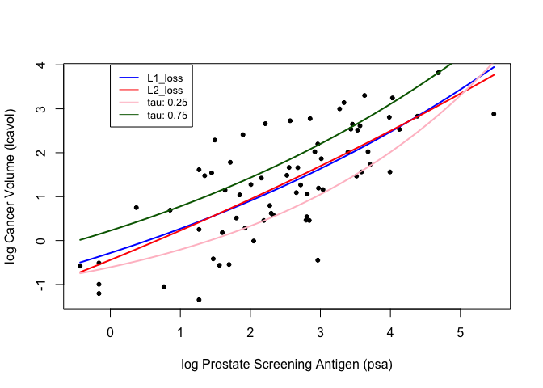

Homework 2 Loss functions in practice
================
Jaewoo Cho
January 29, 2022

# Source Code

``` r
## load prostate data
prostate <- 
  read.table(url(
    'https://web.stanford.edu/~hastie/ElemStatLearn/datasets/prostate.data'))

## subset to training examples
prostate_train <- subset(prostate, train==TRUE)

## plot lcavol vs lpsa
plot_psa_data <- function(dat=prostate_train) {
  plot(dat$lpsa, dat$lcavol,
       xlab="log Prostate Screening Antigen (psa)",
       ylab="log Cancer Volume (lcavol)",
       pch = 20)
}
plot_psa_data()
```

<!-- -->

``` r
############################
## regular linear regression
############################

## L2 loss function
L2_loss <- function(y, yhat)
  (y-yhat)^2

## fit simple linear model using numerical optimization
fit_lin <- function(y, x, loss=L2_loss, beta_init = c(-0.51, 0.75)) {
  err <- function(beta)
    mean(loss(y,  beta[1] + beta[2]*x))
  beta <- optim(par = beta_init, fn = err)
  return(beta)
}

## make predictions from linear model
predict_lin <- function(x, beta)
  beta[1] + beta[2]*x

## fit linear model
lin_beta <- fit_lin(y=prostate_train$lcavol,
                    x=prostate_train$lpsa,
                    loss=L2_loss)

## compute predictions for a grid of inputs
x_grid <- seq(min(prostate_train$lpsa),
              max(prostate_train$lpsa),
              length.out=100)
lin_pred <- predict_lin(x=x_grid, beta=lin_beta$par)

## plot data
plot_psa_data()

## plot predictions
lines(x=x_grid, y=lin_pred, col='darkgreen', lwd=2)

## do the same thing with 'lm'
lin_fit_lm <- lm(lcavol ~ lpsa, data=prostate_train)

## make predictins using 'lm' object
lin_pred_lm <- predict(lin_fit_lm, data.frame(lpsa=x_grid))

## plot predictions from 'lm'
lines(x=x_grid, y=lin_pred_lm, col='pink', lty=2, lwd=2)
```

<!-- -->

``` r
##################################
## try modifying the loss function
##################################

## custom loss function
custom_loss <- function(y, yhat)
  qrnn::tilted.abs(y-yhat, tau = 0.25)

## plot custom loss function
err_grd <- seq(-1,1,length.out=200)
plot(err_grd, custom_loss(err_grd,0), type='l',
     xlab='y-yhat', ylab='custom loss')
```

<!-- -->

``` r
## fit linear model with custom loss
lin_beta_custom <- fit_lin(y=prostate_train$lcavol,
                    x=prostate_train$lpsa,
                    loss=custom_loss)

lin_pred_custom <- predict_lin(x=x_grid, beta=lin_beta_custom$par)

## plot data
plot_psa_data()

## plot predictions from L2 loss
lines(x=x_grid, y=lin_pred, col='darkgreen', lwd=2)

## plot predictions from custom loss
lines(x=x_grid, y=lin_pred_custom, col='pink', lwd=2, lty=2)
```

<!-- -->

# Hw Questions

1.  Write functions that implement the L1 loss and tilted absolute loss
    functions.

``` r
## custom loss function
custom_loss <- function(y, yhat)
  qrnn::tilted.abs(y-yhat, tau = 0.25)

## plot custom loss function
err_grd <- seq(-1,1,length.out=200)
plot(err_grd, custom_loss(err_grd,0), type='l', main = "Figure for loss function", col = 'dark green',
     xlab='y-yhat', ylab='custom loss')
```

<!-- -->

2.  Create a figure that shows lpsa (x-axis) versus lcavol (y-axis). Add
    and label (using the ‘legend’ function) the linear model predictors
    associated with L2 loss, L1 loss, and tilted absolute value loss for
    tau = 0.25 and 0.75.

``` r
## load prostate data
prostate <- 
  read.table(url(
    'https://web.stanford.edu/~hastie/ElemStatLearn/datasets/prostate.data'))

## subset to training examples
prostate_train <- subset(prostate, train==TRUE)

## plot lcavol vs lpsa
plot_psa_data <- function(dat=prostate_train) {
  plot(dat$lpsa, dat$lcavol,
       xlab="log Prostate Screening Antigen (psa)",
       ylab="log Cancer Volume (lcavol)",
       main = "Figure: lpsa versus lcavol ",
       pch = 20)
}
plot_psa_data()

## custom loss function tau = 0.25
custom_loss_0.25 <- function(y, yhat)
  qrnn::tilted.abs(y-yhat, tau = 0.25)

## plot custom loss function
err_grd <- seq(-2,10,length.out=200)
lines(err_grd, custom_loss_0.25(err_grd,0), type='l', col = "red",
     xlab='y-yhat', ylab='custom loss')

## custom loss function tau = 0.75
custom_loss_0.75 <- function(y, yhat)
  qrnn::tilted.abs(y-yhat, tau = 0.75)

## plot custom loss function
err_grd <- seq(-2,10,length.out=200)
lines(err_grd, custom_loss_0.75(err_grd,0), type='l', col = "blue",
     xlab='y-yhat', ylab='custom loss')

# Add legend
legend(-0.5, 4, legend=c("tau: 0.25", "tau: 0.75"),
       col=c("red", "blue"), lty=1:1, cex=0.8)
```

<!-- -->

3.  Write functions to fit and predict from a simple nonlinear model
    with three parameters defined by ‘beta\[1\] +
    beta\[2\]*exp(-beta\[3\]*x)’. Hint: make copies of ‘fit_lin’ and
    ‘predict_lin’ and modify them to fit the nonlinear model. Use
    c(-1.0, 0.0, -0.3) as ‘beta_init’.

``` r
## L2 loss function
L2_loss <- function(y, yhat)
  (y-yhat)^2

## fit simple linear model using numerical optimization
fit_lin <- function(y, x, loss=L2_loss, beta_init = c(-1.0, 0.0, -0.3)) {
  err <- function(beta)
    mean(loss(y,  beta[1] + beta[2]*exp(-beta[3]*x)))
  beta <- optim(par = beta_init, fn = err)
  return(beta)
}

## make predictions from linear model
predict_lin <- function(x, beta)
  beta[1] + beta[2]**exp(-beta[3]*x)

## fit linear model
lin_beta <- fit_lin(y=prostate_train$lcavol,
                    x=prostate_train$lpsa,
                    loss=L2_loss)

## compute predictions for a grid of inputs
x_grid <- seq(min(prostate_train$lpsa),
              max(prostate_train$lpsa),
              length.out=100)
lin_pred <- predict_lin(x=x_grid, beta=lin_beta$par)
```

4.  Create a figure that shows lpsa (x-axis) versus lcavol (y-axis). Add
    and label (using the ‘legend’ function) the nonlinear model
    predictors associated with L2 loss, L1 loss, and tilted absolute
    value loss for tau = 0.25 and 0.75.

``` r
## plot data
plot_psa_data()

## plot predictions
lines(x=x_grid, y=lin_pred, col='darkgreen', lwd=2)

## do the same thing with 'lm'
lin_fit_lm <- lm(lcavol ~ lpsa, data=prostate_train)

## make predictins using 'lm' object
lin_pred_lm <- predict(lin_fit_lm, data.frame(lpsa=x_grid))

## plot predictions from 'lm'
lines(x=x_grid, y=lin_pred_lm, col='pink', lty=1, lwd=2)


## custom loss function tau = 0.25
custom_loss_0.25 <- function(y, yhat)
  qrnn::tilted.abs(y-yhat, tau = 0.25)

## plot custom loss function
err_grd <- seq(-2,10,length.out=200)
lines(err_grd, custom_loss_0.25(err_grd,0), type='l', col = "red",
     xlab='y-yhat', ylab='custom loss')

## custom loss function tau = 0.75
custom_loss_0.75 <- function(y, yhat)
  qrnn::tilted.abs(y-yhat, tau = 0.75)

## plot custom loss function
err_grd <- seq(-2,10,length.out=200)
lines(err_grd, custom_loss_0.75(err_grd,0), type='l', col = "blue",
     xlab='y-yhat', ylab='custom loss')

# Add legend
legend(-0.5, 4, 
       legend=c("tau: 0.25", "tau: 0.75", "lin_pred", "lin_pred_lm"),
       col=c("red", "blue", "darkgreen", "pink"), 
       lty=1:1, cex=0.8)
```

<!-- -->
