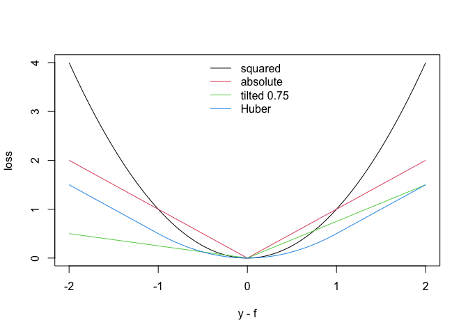
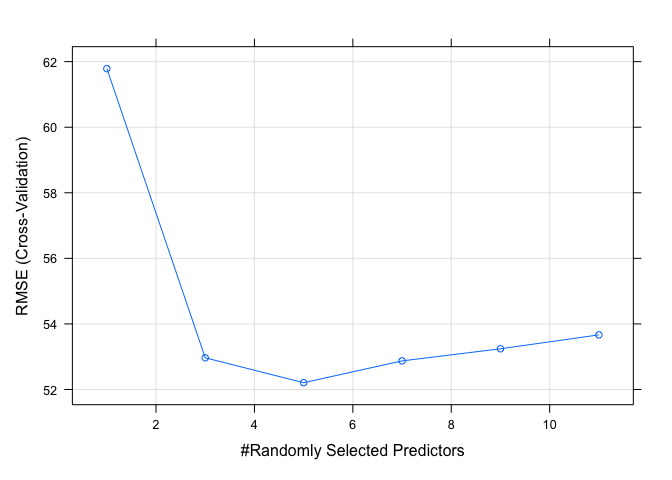

Homework 5: Boosting and AdaBoost.M1
================
Jaewoo Cho

# Goal: Understand and implement a random forest classifier.

## 1. Using the “vowel.train” data, develop a random forest (e.g., using the “randomForest” package) or gradient boosted classifier for the vowel data.

## 2. Fit a random forest or gradient boosted model to the “vowel.train” data using all of the 11 features using the default values of the tuning parameters.

## 3.Use 5-fold CV to tune the number of variables randomly sampled as candidates at each split if using random forest, or the ensemble size if using gradient boosting.

## 4. With the tuned model, make predictions using the majority vote method, and compute the misclassification rate using the ‘vowel.test’ data.

## Libraries

``` r
library('magrittr')
```

    ## Warning: package 'magrittr' was built under R version 4.1.2

``` r
library('dplyr')
```

    ## 
    ## Attaching package: 'dplyr'

    ## The following objects are masked from 'package:stats':
    ## 
    ##     filter, lag

    ## The following objects are masked from 'package:base':
    ## 
    ##     intersect, setdiff, setequal, union

``` r
library('rpart')
```

    ## Warning: package 'rpart' was built under R version 4.1.2

``` r
library('partykit')
```

    ## Loading required package: grid

    ## Loading required package: libcoin

    ## Loading required package: mvtnorm

``` r
library('utils')
library('manipulate')
library('randomForest')
```

    ## Warning: package 'randomForest' was built under R version 4.1.2

    ## randomForest 4.7-1

    ## Type rfNews() to see new features/changes/bug fixes.

    ## 
    ## Attaching package: 'randomForest'

    ## The following object is masked from 'package:dplyr':
    ## 
    ##     combine

``` r
library('xgboost')
```

    ## Warning: package 'xgboost' was built under R version 4.1.2

    ## 
    ## Attaching package: 'xgboost'

    ## The following object is masked from 'package:dplyr':
    ## 
    ##     slice

## Import the training data

``` r
# Load the data from the URL
url <- "https://hastie.su.domains/ElemStatLearn/datasets/vowel.train"
train_vowel <- read.table(url, header = TRUE)

# Create a sample train_data frame
train_data <- train_vowel
# Split the comma-separated values into separate columns
train_data <- data.frame(do.call("rbind", strsplit(as.character(train_data[,1]), ",")))

# Rename the columns
colnames(train_data) <- c("row.names", "y", "x.1", "x.2", "x.3", "x.4", "x.5", "x.6", "x.7", "x.8", "x.9", "x.10")

# Convert the columns to the appropriate train_data types
train_data$row.names <- as.numeric(train_data$row.names)
train_data$y <- as.numeric(train_data$y)
train_data$x.1 <- as.numeric(train_data$x.1)
train_data$x.2 <- as.numeric(train_data$x.2)
train_data$x.3 <- as.numeric(train_data$x.3)
train_data$x.4 <- as.numeric(train_data$x.4)
train_data$x.5 <- as.numeric(train_data$x.5)
train_data$x.6 <- as.numeric(train_data$x.6)
train_data$x.7 <- as.numeric(train_data$x.7)
train_data$x.8 <- as.numeric(train_data$x.8)
train_data$x.9 <- as.numeric(train_data$x.9)
train_data$x.10 <- as.numeric(train_data$x.10)

# View the resulting train_data frame
# train_data
```

## Import the testing data

``` r
# Load the data from the URL
url <- "https://hastie.su.domains/ElemStatLearn/datasets/vowel.test"
test_vowel <- read.table(url, header = TRUE)

# Create a sample test_data frame
test_data <- test_vowel
# Split the comma-separated values into separate columns
test_data <- data.frame(do.call("rbind", strsplit(as.character(test_data[,1]), ",")))

# Rename the columns
colnames(test_data) <- c("row.names", "y", "x.1", "x.2", "x.3", "x.4", "x.5", "x.6", "x.7", "x.8", "x.9", "x.10")

# Convert the columns to the appropriate test_data types
test_data$row.names <- as.numeric(test_data$row.names)
test_data$y <- as.numeric(test_data$y)
test_data$x.1 <- as.numeric(test_data$x.1)
test_data$x.2 <- as.numeric(test_data$x.2)
test_data$x.3 <- as.numeric(test_data$x.3)
test_data$x.4 <- as.numeric(test_data$x.4)
test_data$x.5 <- as.numeric(test_data$x.5)
test_data$x.6 <- as.numeric(test_data$x.6)
test_data$x.7 <- as.numeric(test_data$x.7)
test_data$x.8 <- as.numeric(test_data$x.8)
test_data$x.9 <- as.numeric(test_data$x.9)
test_data$x.10 <- as.numeric(test_data$x.10)

# View the resulting test_data frame
# test_data
```

## Loss functions

``` r
####################
## loss functions ##
####################

## Huber loss
loss_huber <- function(f, y, delta=1)
  ifelse(abs(y-f) <= delta,
    0.5*(y-f)^2, delta*(abs(y-f) - 0.5*delta))

## squared error loss
loss_square <- function(f, y)
  (y-f)^2

## absolute error loss
loss_absolute <- function(f, y)
  abs(y-f)

## tilted absolute error loss
## tau - target quantile for prediction
loss_tilted <- function(f, y, tau=0.75)
  ifelse(y-f > 0, (y-f) * tau, (y-f) * (tau - 1))

## plot loss as functions of residual (y-f) 
curve(loss_square(0, x), from=-2, to=2,
      xlab='y - f', ylab='loss')
curve(loss_absolute(0, x), from=-2, to=2, add=T, col=2)
curve(loss_tilted(0, x, 0.75), from=-2, to=2, add=T, col=3)
curve(loss_huber(0, x), from=-2, to=2, add=T, col=4)
legend('top', c('squared','absolute','tilted 0.75','Huber'),
       col=1:4, lty=1, bty='n')
```

<!-- -->

``` r
## constant prediction for given loss 
## this applies decision theory predict the
## value 'f' that minimizes the sum of loss
## for loss=loss_square, this returns mean(y)
## for loss=loss_absolute, this returns quantile(y, probs=0.5)
## for loss=loss_huber, this returns some other value
const_pred <- function(y, loss=loss_huber,
                       limits=c(-1e10,1e10), ...) {
  sum_loss <- function(f) sum(loss(f, y, ...))
  optimize(sum_loss, interval=limits)$minimum
}

## const_pred examples
y1 <- rexp(1000) ## mean = 1.000, median = 0.693
mean(y1)
```

    ## [1] 0.9837394

``` r
const_pred(y1, loss=loss_square)
```

    ## [1] 0.9837399

``` r
median(y1)
```

    ## [1] 0.640607

``` r
const_pred(y1, loss=loss_absolute)
```

    ## [1] 0.6405072

``` r
const_pred(y1, loss=loss_huber)
```

    ## [1] 0.8137202

``` r
###############################
## weak learner for boosting ##
###############################

## fit a stump (using squared error loss: method='anova')
stump <- function(dat, frm, maxdepth=1) {
  rpart(formula=frm, data=dat, method='anova',
        minsplit=2,minbucket=1,maxdepth=maxdepth,
        cp=0,maxcompete=0,maxsurrogate=0,
        usesurrogate=0,xval=0) %>%
    ## convert to constparty to make easier to 
    ## manipulate predictions from this model
    as.constparty
}
```

## Random Forest Model

``` r
# Fit a random forest model
rf_model <- randomForest(y ~ ., data = train_data)

# View the model summary
rf_model
```

    ## 
    ## Call:
    ##  randomForest(formula = y ~ ., data = train_data) 
    ##                Type of random forest: regression
    ##                      Number of trees: 500
    ## No. of variables tried at each split: 3
    ## 
    ##           Mean of squared residuals: 0.7713719
    ##                     % Var explained: 92.29

``` r
library(randomForest)
library(caret)
```

    ## Warning: package 'caret' was built under R version 4.1.2

    ## Loading required package: ggplot2

    ## 
    ## Attaching package: 'ggplot2'

    ## The following object is masked from 'package:randomForest':
    ## 
    ##     margin

    ## Loading required package: lattice

``` r
# Define the tuning grid
tuneGrid <- expand.grid(mtry = seq(1, ncol(train_data) - 1, by = 2))

# Set up the cross-validation
control <- trainControl(method = "cv", number = 5)

# Train the random forest with cross-validation
set.seed(123)
rf <- train(x = train_data[, -1], y = train_data[, 1],
            method = "rf", ntree = 500,
            tuneGrid = tuneGrid,
            trControl = control)

# Print the results
print(rf)
```

    ## Random Forest 
    ## 
    ## 528 samples
    ##  11 predictor
    ## 
    ## No pre-processing
    ## Resampling: Cross-Validated (5 fold) 
    ## Summary of sample sizes: 423, 424, 422, 421, 422 
    ## Resampling results across tuning parameters:
    ## 
    ##   mtry  RMSE      Rsquared   MAE     
    ##    1    61.78593  0.8908508  49.25916
    ##    3    52.96732  0.9081346  40.62460
    ##    5    52.20642  0.9054763  38.87512
    ##    7    52.87233  0.8988020  38.61847
    ##    9    53.24198  0.8946419  38.18955
    ##   11    53.66567  0.8918767  38.18162
    ## 
    ## RMSE was used to select the optimal model using the smallest value.
    ## The final value used for the model was mtry = 5.

``` r
# Plot the results
plot(rf)
```

<!-- -->

``` r
library(randomForest)
library(caret)

# load the vowel.train data
# train_data

# 1. develop a random forest for the vowel data
rf_vowel <- randomForest(formula = y ~ ., data = train_data)

# 2. fit a random forest model using all features with default tuning parameters
rf_default <- randomForest(formula = y ~ ., data = train_data)

# 3. use 5-fold CV to tune the number of variables randomly sampled as candidates at each split
tuneGrid <- expand.grid(mtry = seq(1, ncol(train_data) - 1, by = 2))
control <- trainControl(method = "cv", number = 5)
rf_tuned <- train(x = train_data[, -1], y = train_data[, 1], 
                  method = "rf", ntree = 500, tuneGrid = tuneGrid,
                  trControl = control)

# 4. make predictions using the majority vote method, and compute the misclassification rate
# load the vowel.test data
# test_data

# predict the class for the vowel.test data using the tuned random forest model
y_pred <- predict(rf_tuned, newdata = test_data[, -1], type = "raw")

# compute the misclassification rate
misclassification_rate <- mean(y_pred != test_data[, 1])
misclassification_rate
```

    ## [1] 1

------------------------------------------------------------------------

# XGboost model

``` r
# Split the data into features and target
train_X <- train_data[, 3:12]
train_y <- train_data$y

# Fit a gradient boosted model with default tuning parameters
model <- xgboost(data = as.matrix(train_X), label = train_y, nrounds = 50)
```

    ## [1]  train-rmse:4.599697 
    ## [2]  train-rmse:3.350324 
    ## [3]  train-rmse:2.485207 
    ## [4]  train-rmse:1.888163 
    ## [5]  train-rmse:1.430851 
    ## [6]  train-rmse:1.134093 
    ## [7]  train-rmse:0.914695 
    ## [8]  train-rmse:0.711988 
    ## [9]  train-rmse:0.617216 
    ## [10] train-rmse:0.531064 
    ## [11] train-rmse:0.483871 
    ## [12] train-rmse:0.407501 
    ## [13] train-rmse:0.374300 
    ## [14] train-rmse:0.348659 
    ## [15] train-rmse:0.320308 
    ## [16] train-rmse:0.297381 
    ## [17] train-rmse:0.278422 
    ## [18] train-rmse:0.259181 
    ## [19] train-rmse:0.249042 
    ## [20] train-rmse:0.236537 
    ## [21] train-rmse:0.222837 
    ## [22] train-rmse:0.209632 
    ## [23] train-rmse:0.200539 
    ## [24] train-rmse:0.191716 
    ## [25] train-rmse:0.186439 
    ## [26] train-rmse:0.176411 
    ## [27] train-rmse:0.159349 
    ## [28] train-rmse:0.153721 
    ## [29] train-rmse:0.144252 
    ## [30] train-rmse:0.135729 
    ## [31] train-rmse:0.133394 
    ## [32] train-rmse:0.130287 
    ## [33] train-rmse:0.121986 
    ## [34] train-rmse:0.112076 
    ## [35] train-rmse:0.105059 
    ## [36] train-rmse:0.102912 
    ## [37] train-rmse:0.095745 
    ## [38] train-rmse:0.091892 
    ## [39] train-rmse:0.089761 
    ## [40] train-rmse:0.086291 
    ## [41] train-rmse:0.084972 
    ## [42] train-rmse:0.081172 
    ## [43] train-rmse:0.078768 
    ## [44] train-rmse:0.075385 
    ## [45] train-rmse:0.073123 
    ## [46] train-rmse:0.067656 
    ## [47] train-rmse:0.065573 
    ## [48] train-rmse:0.062659 
    ## [49] train-rmse:0.060158 
    ## [50] train-rmse:0.058029

``` r
library(caret)
library(xgboost)

# Split the data into features and target
train_X <- train_data[, 3:12]
train_y <- train_data$y

# Define the tuning parameter grid
tune_grid <- expand.grid(nrounds = c(50, 100),
                         max_depth = c(3, 4),
                         eta = c(0.01, 0.05),
                         gamma = c(0, 0.1),
                         colsample_bytree = c(0.5, 0.8),
                         min_child_weight = c(1, 5),
                         subsample = seq(0.5, 1, by = 0.1))

# Set up the cross-validation control
cv_ctrl <- trainControl(method = "cv", number = 5)

# Perform the tuning using cross-validation
model_tune <- train(x = as.matrix(train_X),
                    y = train_y,
                    method = "xgbTree",
                    tuneGrid = tune_grid,
                    trControl = cv_ctrl)
```

    ## [17:55:34] WARNING: src/c_api/c_api.cc:935: `ntree_limit` is deprecated, use `iteration_range` instead.
    ## [17:55:34] WARNING: src/c_api/c_api.cc:935: `ntree_limit` is deprecated, use `iteration_range` instead.
    ## [17:55:34] WARNING: src/c_api/c_api.cc:935: `ntree_limit` is deprecated, use `iteration_range` instead.
    ## [17:55:34] WARNING: src/c_api/c_api.cc:935: `ntree_limit` is deprecated, use `iteration_range` instead.
    ## [17:55:34] WARNING: src/c_api/c_api.cc:935: `ntree_limit` is deprecated, use `iteration_range` instead.
    ## [17:55:34] WARNING: src/c_api/c_api.cc:935: `ntree_limit` is deprecated, use `iteration_range` instead.
    ## [17:55:34] WARNING: src/c_api/c_api.cc:935: `ntree_limit` is deprecated, use `iteration_range` instead.
    ## [17:55:34] WARNING: src/c_api/c_api.cc:935: `ntree_limit` is deprecated, use `iteration_range` instead.
    ## [17:55:34] WARNING: src/c_api/c_api.cc:935: `ntree_limit` is deprecated, use `iteration_range` instead.
    ## [17:55:34] WARNING: src/c_api/c_api.cc:935: `ntree_limit` is deprecated, use `iteration_range` instead.
    ## [17:55:34] WARNING: src/c_api/c_api.cc:935: `ntree_limit` is deprecated, use `iteration_range` instead.
    ## [17:55:34] WARNING: src/c_api/c_api.cc:935: `ntree_limit` is deprecated, use `iteration_range` instead.
    ## [17:55:34] WARNING: src/c_api/c_api.cc:935: `ntree_limit` is deprecated, use `iteration_range` instead.
    ## [17:55:35] WARNING: src/c_api/c_api.cc:935: `ntree_limit` is deprecated, use `iteration_range` instead.
    ## [17:55:35] WARNING: src/c_api/c_api.cc:935: `ntree_limit` is deprecated, use `iteration_range` instead.
    ## [17:55:35] WARNING: src/c_api/c_api.cc:935: `ntree_limit` is deprecated, use `iteration_range` instead.
    ## [17:55:35] WARNING: src/c_api/c_api.cc:935: `ntree_limit` is deprecated, use `iteration_range` instead.
    ## [17:55:35] WARNING: src/c_api/c_api.cc:935: `ntree_limit` is deprecated, use `iteration_range` instead.
    ## [17:55:35] WARNING: src/c_api/c_api.cc:935: `ntree_limit` is deprecated, use `iteration_range` instead.
    ## [17:55:35] WARNING: src/c_api/c_api.cc:935: `ntree_limit` is deprecated, use `iteration_range` instead.
    ## [17:55:35] WARNING: src/c_api/c_api.cc:935: `ntree_limit` is deprecated, use `iteration_range` instead.
    ## [17:55:35] WARNING: src/c_api/c_api.cc:935: `ntree_limit` is deprecated, use `iteration_range` instead.
    ## [17:55:35] WARNING: src/c_api/c_api.cc:935: `ntree_limit` is deprecated, use `iteration_range` instead.
    ## [17:55:35] WARNING: src/c_api/c_api.cc:935: `ntree_limit` is deprecated, use `iteration_range` instead.
    ## [17:55:35] WARNING: src/c_api/c_api.cc:935: `ntree_limit` is deprecated, use `iteration_range` instead.
    ## [17:55:35] WARNING: src/c_api/c_api.cc:935: `ntree_limit` is deprecated, use `iteration_range` instead.
    ## [17:55:35] WARNING: src/c_api/c_api.cc:935: `ntree_limit` is deprecated, use `iteration_range` instead.
    ## [17:55:35] WARNING: src/c_api/c_api.cc:935: `ntree_limit` is deprecated, use `iteration_range` instead.
    ## [17:55:35] WARNING: src/c_api/c_api.cc:935: `ntree_limit` is deprecated, use `iteration_range` instead.
    ## [17:55:35] WARNING: src/c_api/c_api.cc:935: `ntree_limit` is deprecated, use `iteration_range` instead.
    ## [17:55:35] WARNING: src/c_api/c_api.cc:935: `ntree_limit` is deprecated, use `iteration_range` instead.
    ## [17:55:35] WARNING: src/c_api/c_api.cc:935: `ntree_limit` is deprecated, use `iteration_range` instead.
    ## [17:55:35] WARNING: src/c_api/c_api.cc:935: `ntree_limit` is deprecated, use `iteration_range` instead.
    ## [17:55:35] WARNING: src/c_api/c_api.cc:935: `ntree_limit` is deprecated, use `iteration_range` instead.
    ## [17:55:35] WARNING: src/c_api/c_api.cc:935: `ntree_limit` is deprecated, use `iteration_range` instead.
    ## [17:55:35] WARNING: src/c_api/c_api.cc:935: `ntree_limit` is deprecated, use `iteration_range` instead.
    ## [17:55:35] WARNING: src/c_api/c_api.cc:935: `ntree_limit` is deprecated, use `iteration_range` instead.
    ## [17:55:35] WARNING: src/c_api/c_api.cc:935: `ntree_limit` is deprecated, use `iteration_range` instead.
    ## [17:55:35] WARNING: src/c_api/c_api.cc:935: `ntree_limit` is deprecated, use `iteration_range` instead.
    ## [17:55:36] WARNING: src/c_api/c_api.cc:935: `ntree_limit` is deprecated, use `iteration_range` instead.
    ## [17:55:36] WARNING: src/c_api/c_api.cc:935: `ntree_limit` is deprecated, use `iteration_range` instead.
    ## [17:55:36] WARNING: src/c_api/c_api.cc:935: `ntree_limit` is deprecated, use `iteration_range` instead.
    ## [17:55:36] WARNING: src/c_api/c_api.cc:935: `ntree_limit` is deprecated, use `iteration_range` instead.
    ## [17:55:36] WARNING: src/c_api/c_api.cc:935: `ntree_limit` is deprecated, use `iteration_range` instead.
    ## [17:55:36] WARNING: src/c_api/c_api.cc:935: `ntree_limit` is deprecated, use `iteration_range` instead.
    ## [17:55:36] WARNING: src/c_api/c_api.cc:935: `ntree_limit` is deprecated, use `iteration_range` instead.
    ## [17:55:36] WARNING: src/c_api/c_api.cc:935: `ntree_limit` is deprecated, use `iteration_range` instead.
    ## [17:55:36] WARNING: src/c_api/c_api.cc:935: `ntree_limit` is deprecated, use `iteration_range` instead.
    ## [17:55:36] WARNING: src/c_api/c_api.cc:935: `ntree_limit` is deprecated, use `iteration_range` instead.
    ## [17:55:36] WARNING: src/c_api/c_api.cc:935: `ntree_limit` is deprecated, use `iteration_range` instead.
    ## [17:55:36] WARNING: src/c_api/c_api.cc:935: `ntree_limit` is deprecated, use `iteration_range` instead.
    ## [17:55:36] WARNING: src/c_api/c_api.cc:935: `ntree_limit` is deprecated, use `iteration_range` instead.
    ## [17:55:36] WARNING: src/c_api/c_api.cc:935: `ntree_limit` is deprecated, use `iteration_range` instead.
    ## [17:55:36] WARNING: src/c_api/c_api.cc:935: `ntree_limit` is deprecated, use `iteration_range` instead.
    ## [17:55:36] WARNING: src/c_api/c_api.cc:935: `ntree_limit` is deprecated, use `iteration_range` instead.
    ## [17:55:36] WARNING: src/c_api/c_api.cc:935: `ntree_limit` is deprecated, use `iteration_range` instead.
    ## [17:55:36] WARNING: src/c_api/c_api.cc:935: `ntree_limit` is deprecated, use `iteration_range` instead.
    ## [17:55:36] WARNING: src/c_api/c_api.cc:935: `ntree_limit` is deprecated, use `iteration_range` instead.
    ## [17:55:36] WARNING: src/c_api/c_api.cc:935: `ntree_limit` is deprecated, use `iteration_range` instead.
    ## [17:55:36] WARNING: src/c_api/c_api.cc:935: `ntree_limit` is deprecated, use `iteration_range` instead.
    ## [17:55:36] WARNING: src/c_api/c_api.cc:935: `ntree_limit` is deprecated, use `iteration_range` instead.
    ## [17:55:36] WARNING: src/c_api/c_api.cc:935: `ntree_limit` is deprecated, use `iteration_range` instead.
    ## [17:55:36] WARNING: src/c_api/c_api.cc:935: `ntree_limit` is deprecated, use `iteration_range` instead.
    ## [17:55:37] WARNING: src/c_api/c_api.cc:935: `ntree_limit` is deprecated, use `iteration_range` instead.
    ## [17:55:37] WARNING: src/c_api/c_api.cc:935: `ntree_limit` is deprecated, use `iteration_range` instead.
    ## [17:55:37] WARNING: src/c_api/c_api.cc:935: `ntree_limit` is deprecated, use `iteration_range` instead.
    ## [17:55:37] WARNING: src/c_api/c_api.cc:935: `ntree_limit` is deprecated, use `iteration_range` instead.
    ## [17:55:37] WARNING: src/c_api/c_api.cc:935: `ntree_limit` is deprecated, use `iteration_range` instead.
    ## [17:55:37] WARNING: src/c_api/c_api.cc:935: `ntree_limit` is deprecated, use `iteration_range` instead.
    ## [17:55:37] WARNING: src/c_api/c_api.cc:935: `ntree_limit` is deprecated, use `iteration_range` instead.
    ## [17:55:37] WARNING: src/c_api/c_api.cc:935: `ntree_limit` is deprecated, use `iteration_range` instead.
    ## [17:55:37] WARNING: src/c_api/c_api.cc:935: `ntree_limit` is deprecated, use `iteration_range` instead.
    ## [17:55:37] WARNING: src/c_api/c_api.cc:935: `ntree_limit` is deprecated, use `iteration_range` instead.
    ## [17:55:37] WARNING: src/c_api/c_api.cc:935: `ntree_limit` is deprecated, use `iteration_range` instead.
    ## [17:55:37] WARNING: src/c_api/c_api.cc:935: `ntree_limit` is deprecated, use `iteration_range` instead.
    ## [17:55:37] WARNING: src/c_api/c_api.cc:935: `ntree_limit` is deprecated, use `iteration_range` instead.
    ## [17:55:37] WARNING: src/c_api/c_api.cc:935: `ntree_limit` is deprecated, use `iteration_range` instead.
    ## [17:55:37] WARNING: src/c_api/c_api.cc:935: `ntree_limit` is deprecated, use `iteration_range` instead.
    ## [17:55:37] WARNING: src/c_api/c_api.cc:935: `ntree_limit` is deprecated, use `iteration_range` instead.
    ## [17:55:37] WARNING: src/c_api/c_api.cc:935: `ntree_limit` is deprecated, use `iteration_range` instead.
    ## [17:55:37] WARNING: src/c_api/c_api.cc:935: `ntree_limit` is deprecated, use `iteration_range` instead.
    ## [17:55:37] WARNING: src/c_api/c_api.cc:935: `ntree_limit` is deprecated, use `iteration_range` instead.
    ## [17:55:37] WARNING: src/c_api/c_api.cc:935: `ntree_limit` is deprecated, use `iteration_range` instead.
    ## [17:55:37] WARNING: src/c_api/c_api.cc:935: `ntree_limit` is deprecated, use `iteration_range` instead.
    ## [17:55:37] WARNING: src/c_api/c_api.cc:935: `ntree_limit` is deprecated, use `iteration_range` instead.
    ## [17:55:38] WARNING: src/c_api/c_api.cc:935: `ntree_limit` is deprecated, use `iteration_range` instead.
    ## [17:55:38] WARNING: src/c_api/c_api.cc:935: `ntree_limit` is deprecated, use `iteration_range` instead.
    ## [17:55:38] WARNING: src/c_api/c_api.cc:935: `ntree_limit` is deprecated, use `iteration_range` instead.
    ## [17:55:38] WARNING: src/c_api/c_api.cc:935: `ntree_limit` is deprecated, use `iteration_range` instead.
    ## [17:55:38] WARNING: src/c_api/c_api.cc:935: `ntree_limit` is deprecated, use `iteration_range` instead.
    ## [17:55:38] WARNING: src/c_api/c_api.cc:935: `ntree_limit` is deprecated, use `iteration_range` instead.
    ## [17:55:38] WARNING: src/c_api/c_api.cc:935: `ntree_limit` is deprecated, use `iteration_range` instead.
    ## [17:55:38] WARNING: src/c_api/c_api.cc:935: `ntree_limit` is deprecated, use `iteration_range` instead.
    ## [17:55:38] WARNING: src/c_api/c_api.cc:935: `ntree_limit` is deprecated, use `iteration_range` instead.
    ## [17:55:38] WARNING: src/c_api/c_api.cc:935: `ntree_limit` is deprecated, use `iteration_range` instead.
    ## [17:55:38] WARNING: src/c_api/c_api.cc:935: `ntree_limit` is deprecated, use `iteration_range` instead.
    ## [17:55:38] WARNING: src/c_api/c_api.cc:935: `ntree_limit` is deprecated, use `iteration_range` instead.
    ## [17:55:38] WARNING: src/c_api/c_api.cc:935: `ntree_limit` is deprecated, use `iteration_range` instead.
    ## [17:55:38] WARNING: src/c_api/c_api.cc:935: `ntree_limit` is deprecated, use `iteration_range` instead.
    ## [17:55:38] WARNING: src/c_api/c_api.cc:935: `ntree_limit` is deprecated, use `iteration_range` instead.
    ## [17:55:38] WARNING: src/c_api/c_api.cc:935: `ntree_limit` is deprecated, use `iteration_range` instead.
    ## [17:55:38] WARNING: src/c_api/c_api.cc:935: `ntree_limit` is deprecated, use `iteration_range` instead.
    ## [17:55:38] WARNING: src/c_api/c_api.cc:935: `ntree_limit` is deprecated, use `iteration_range` instead.
    ## [17:55:38] WARNING: src/c_api/c_api.cc:935: `ntree_limit` is deprecated, use `iteration_range` instead.
    ## [17:55:38] WARNING: src/c_api/c_api.cc:935: `ntree_limit` is deprecated, use `iteration_range` instead.
    ## [17:55:38] WARNING: src/c_api/c_api.cc:935: `ntree_limit` is deprecated, use `iteration_range` instead.
    ## [17:55:38] WARNING: src/c_api/c_api.cc:935: `ntree_limit` is deprecated, use `iteration_range` instead.
    ## [17:55:38] WARNING: src/c_api/c_api.cc:935: `ntree_limit` is deprecated, use `iteration_range` instead.
    ## [17:55:38] WARNING: src/c_api/c_api.cc:935: `ntree_limit` is deprecated, use `iteration_range` instead.
    ## [17:55:39] WARNING: src/c_api/c_api.cc:935: `ntree_limit` is deprecated, use `iteration_range` instead.
    ## [17:55:39] WARNING: src/c_api/c_api.cc:935: `ntree_limit` is deprecated, use `iteration_range` instead.
    ## [17:55:39] WARNING: src/c_api/c_api.cc:935: `ntree_limit` is deprecated, use `iteration_range` instead.
    ## [17:55:39] WARNING: src/c_api/c_api.cc:935: `ntree_limit` is deprecated, use `iteration_range` instead.
    ## [17:55:39] WARNING: src/c_api/c_api.cc:935: `ntree_limit` is deprecated, use `iteration_range` instead.
    ## [17:55:39] WARNING: src/c_api/c_api.cc:935: `ntree_limit` is deprecated, use `iteration_range` instead.
    ## [17:55:39] WARNING: src/c_api/c_api.cc:935: `ntree_limit` is deprecated, use `iteration_range` instead.
    ## [17:55:39] WARNING: src/c_api/c_api.cc:935: `ntree_limit` is deprecated, use `iteration_range` instead.
    ## [17:55:39] WARNING: src/c_api/c_api.cc:935: `ntree_limit` is deprecated, use `iteration_range` instead.
    ## [17:55:39] WARNING: src/c_api/c_api.cc:935: `ntree_limit` is deprecated, use `iteration_range` instead.
    ## [17:55:39] WARNING: src/c_api/c_api.cc:935: `ntree_limit` is deprecated, use `iteration_range` instead.
    ## [17:55:39] WARNING: src/c_api/c_api.cc:935: `ntree_limit` is deprecated, use `iteration_range` instead.
    ## [17:55:39] WARNING: src/c_api/c_api.cc:935: `ntree_limit` is deprecated, use `iteration_range` instead.
    ## [17:55:39] WARNING: src/c_api/c_api.cc:935: `ntree_limit` is deprecated, use `iteration_range` instead.
    ## [17:55:39] WARNING: src/c_api/c_api.cc:935: `ntree_limit` is deprecated, use `iteration_range` instead.
    ## [17:55:39] WARNING: src/c_api/c_api.cc:935: `ntree_limit` is deprecated, use `iteration_range` instead.
    ## [17:55:39] WARNING: src/c_api/c_api.cc:935: `ntree_limit` is deprecated, use `iteration_range` instead.
    ## [17:55:39] WARNING: src/c_api/c_api.cc:935: `ntree_limit` is deprecated, use `iteration_range` instead.
    ## [17:55:39] WARNING: src/c_api/c_api.cc:935: `ntree_limit` is deprecated, use `iteration_range` instead.
    ## [17:55:39] WARNING: src/c_api/c_api.cc:935: `ntree_limit` is deprecated, use `iteration_range` instead.
    ## [17:55:39] WARNING: src/c_api/c_api.cc:935: `ntree_limit` is deprecated, use `iteration_range` instead.
    ## [17:55:39] WARNING: src/c_api/c_api.cc:935: `ntree_limit` is deprecated, use `iteration_range` instead.
    ## [17:55:39] WARNING: src/c_api/c_api.cc:935: `ntree_limit` is deprecated, use `iteration_range` instead.
    ## [17:55:39] WARNING: src/c_api/c_api.cc:935: `ntree_limit` is deprecated, use `iteration_range` instead.
    ## [17:55:39] WARNING: src/c_api/c_api.cc:935: `ntree_limit` is deprecated, use `iteration_range` instead.
    ## [17:55:39] WARNING: src/c_api/c_api.cc:935: `ntree_limit` is deprecated, use `iteration_range` instead.
    ## [17:55:40] WARNING: src/c_api/c_api.cc:935: `ntree_limit` is deprecated, use `iteration_range` instead.
    ## [17:55:40] WARNING: src/c_api/c_api.cc:935: `ntree_limit` is deprecated, use `iteration_range` instead.
    ## [17:55:40] WARNING: src/c_api/c_api.cc:935: `ntree_limit` is deprecated, use `iteration_range` instead.
    ## [17:55:40] WARNING: src/c_api/c_api.cc:935: `ntree_limit` is deprecated, use `iteration_range` instead.
    ## [17:55:40] WARNING: src/c_api/c_api.cc:935: `ntree_limit` is deprecated, use `iteration_range` instead.
    ## [17:55:40] WARNING: src/c_api/c_api.cc:935: `ntree_limit` is deprecated, use `iteration_range` instead.
    ## [17:55:40] WARNING: src/c_api/c_api.cc:935: `ntree_limit` is deprecated, use `iteration_range` instead.
    ## [17:55:40] WARNING: src/c_api/c_api.cc:935: `ntree_limit` is deprecated, use `iteration_range` instead.
    ## [17:55:40] WARNING: src/c_api/c_api.cc:935: `ntree_limit` is deprecated, use `iteration_range` instead.
    ## [17:55:40] WARNING: src/c_api/c_api.cc:935: `ntree_limit` is deprecated, use `iteration_range` instead.
    ## [17:55:40] WARNING: src/c_api/c_api.cc:935: `ntree_limit` is deprecated, use `iteration_range` instead.
    ## [17:55:40] WARNING: src/c_api/c_api.cc:935: `ntree_limit` is deprecated, use `iteration_range` instead.
    ## [17:55:40] WARNING: src/c_api/c_api.cc:935: `ntree_limit` is deprecated, use `iteration_range` instead.
    ## [17:55:40] WARNING: src/c_api/c_api.cc:935: `ntree_limit` is deprecated, use `iteration_range` instead.
    ## [17:55:40] WARNING: src/c_api/c_api.cc:935: `ntree_limit` is deprecated, use `iteration_range` instead.
    ## [17:55:40] WARNING: src/c_api/c_api.cc:935: `ntree_limit` is deprecated, use `iteration_range` instead.
    ## [17:55:40] WARNING: src/c_api/c_api.cc:935: `ntree_limit` is deprecated, use `iteration_range` instead.
    ## [17:55:40] WARNING: src/c_api/c_api.cc:935: `ntree_limit` is deprecated, use `iteration_range` instead.
    ## [17:55:40] WARNING: src/c_api/c_api.cc:935: `ntree_limit` is deprecated, use `iteration_range` instead.
    ## [17:55:40] WARNING: src/c_api/c_api.cc:935: `ntree_limit` is deprecated, use `iteration_range` instead.
    ## [17:55:40] WARNING: src/c_api/c_api.cc:935: `ntree_limit` is deprecated, use `iteration_range` instead.
    ## [17:55:40] WARNING: src/c_api/c_api.cc:935: `ntree_limit` is deprecated, use `iteration_range` instead.
    ## [17:55:40] WARNING: src/c_api/c_api.cc:935: `ntree_limit` is deprecated, use `iteration_range` instead.
    ## [17:55:41] WARNING: src/c_api/c_api.cc:935: `ntree_limit` is deprecated, use `iteration_range` instead.
    ## [17:55:41] WARNING: src/c_api/c_api.cc:935: `ntree_limit` is deprecated, use `iteration_range` instead.
    ## [17:55:41] WARNING: src/c_api/c_api.cc:935: `ntree_limit` is deprecated, use `iteration_range` instead.
    ## [17:55:41] WARNING: src/c_api/c_api.cc:935: `ntree_limit` is deprecated, use `iteration_range` instead.
    ## [17:55:41] WARNING: src/c_api/c_api.cc:935: `ntree_limit` is deprecated, use `iteration_range` instead.
    ## [17:55:41] WARNING: src/c_api/c_api.cc:935: `ntree_limit` is deprecated, use `iteration_range` instead.
    ## [17:55:41] WARNING: src/c_api/c_api.cc:935: `ntree_limit` is deprecated, use `iteration_range` instead.
    ## [17:55:41] WARNING: src/c_api/c_api.cc:935: `ntree_limit` is deprecated, use `iteration_range` instead.
    ## [17:55:41] WARNING: src/c_api/c_api.cc:935: `ntree_limit` is deprecated, use `iteration_range` instead.
    ## [17:55:41] WARNING: src/c_api/c_api.cc:935: `ntree_limit` is deprecated, use `iteration_range` instead.
    ## [17:55:41] WARNING: src/c_api/c_api.cc:935: `ntree_limit` is deprecated, use `iteration_range` instead.
    ## [17:55:41] WARNING: src/c_api/c_api.cc:935: `ntree_limit` is deprecated, use `iteration_range` instead.
    ## [17:55:41] WARNING: src/c_api/c_api.cc:935: `ntree_limit` is deprecated, use `iteration_range` instead.
    ## [17:55:41] WARNING: src/c_api/c_api.cc:935: `ntree_limit` is deprecated, use `iteration_range` instead.
    ## [17:55:41] WARNING: src/c_api/c_api.cc:935: `ntree_limit` is deprecated, use `iteration_range` instead.
    ## [17:55:41] WARNING: src/c_api/c_api.cc:935: `ntree_limit` is deprecated, use `iteration_range` instead.
    ## [17:55:41] WARNING: src/c_api/c_api.cc:935: `ntree_limit` is deprecated, use `iteration_range` instead.
    ## [17:55:42] WARNING: src/c_api/c_api.cc:935: `ntree_limit` is deprecated, use `iteration_range` instead.
    ## [17:55:42] WARNING: src/c_api/c_api.cc:935: `ntree_limit` is deprecated, use `iteration_range` instead.
    ## [17:55:42] WARNING: src/c_api/c_api.cc:935: `ntree_limit` is deprecated, use `iteration_range` instead.
    ## [17:55:42] WARNING: src/c_api/c_api.cc:935: `ntree_limit` is deprecated, use `iteration_range` instead.
    ## [17:55:42] WARNING: src/c_api/c_api.cc:935: `ntree_limit` is deprecated, use `iteration_range` instead.
    ## [17:55:42] WARNING: src/c_api/c_api.cc:935: `ntree_limit` is deprecated, use `iteration_range` instead.
    ## [17:55:42] WARNING: src/c_api/c_api.cc:935: `ntree_limit` is deprecated, use `iteration_range` instead.
    ## [17:55:42] WARNING: src/c_api/c_api.cc:935: `ntree_limit` is deprecated, use `iteration_range` instead.
    ## [17:55:42] WARNING: src/c_api/c_api.cc:935: `ntree_limit` is deprecated, use `iteration_range` instead.
    ## [17:55:42] WARNING: src/c_api/c_api.cc:935: `ntree_limit` is deprecated, use `iteration_range` instead.
    ## [17:55:42] WARNING: src/c_api/c_api.cc:935: `ntree_limit` is deprecated, use `iteration_range` instead.
    ## [17:55:42] WARNING: src/c_api/c_api.cc:935: `ntree_limit` is deprecated, use `iteration_range` instead.
    ## [17:55:42] WARNING: src/c_api/c_api.cc:935: `ntree_limit` is deprecated, use `iteration_range` instead.
    ## [17:55:42] WARNING: src/c_api/c_api.cc:935: `ntree_limit` is deprecated, use `iteration_range` instead.
    ## [17:55:42] WARNING: src/c_api/c_api.cc:935: `ntree_limit` is deprecated, use `iteration_range` instead.
    ## [17:55:42] WARNING: src/c_api/c_api.cc:935: `ntree_limit` is deprecated, use `iteration_range` instead.
    ## [17:55:42] WARNING: src/c_api/c_api.cc:935: `ntree_limit` is deprecated, use `iteration_range` instead.
    ## [17:55:42] WARNING: src/c_api/c_api.cc:935: `ntree_limit` is deprecated, use `iteration_range` instead.
    ## [17:55:42] WARNING: src/c_api/c_api.cc:935: `ntree_limit` is deprecated, use `iteration_range` instead.
    ## [17:55:42] WARNING: src/c_api/c_api.cc:935: `ntree_limit` is deprecated, use `iteration_range` instead.
    ## [17:55:42] WARNING: src/c_api/c_api.cc:935: `ntree_limit` is deprecated, use `iteration_range` instead.
    ## [17:55:42] WARNING: src/c_api/c_api.cc:935: `ntree_limit` is deprecated, use `iteration_range` instead.
    ## [17:55:42] WARNING: src/c_api/c_api.cc:935: `ntree_limit` is deprecated, use `iteration_range` instead.
    ## [17:55:43] WARNING: src/c_api/c_api.cc:935: `ntree_limit` is deprecated, use `iteration_range` instead.
    ## [17:55:43] WARNING: src/c_api/c_api.cc:935: `ntree_limit` is deprecated, use `iteration_range` instead.
    ## [17:55:43] WARNING: src/c_api/c_api.cc:935: `ntree_limit` is deprecated, use `iteration_range` instead.
    ## [17:55:43] WARNING: src/c_api/c_api.cc:935: `ntree_limit` is deprecated, use `iteration_range` instead.
    ## [17:55:43] WARNING: src/c_api/c_api.cc:935: `ntree_limit` is deprecated, use `iteration_range` instead.
    ## [17:55:43] WARNING: src/c_api/c_api.cc:935: `ntree_limit` is deprecated, use `iteration_range` instead.
    ## [17:55:43] WARNING: src/c_api/c_api.cc:935: `ntree_limit` is deprecated, use `iteration_range` instead.
    ## [17:55:43] WARNING: src/c_api/c_api.cc:935: `ntree_limit` is deprecated, use `iteration_range` instead.
    ## [17:55:43] WARNING: src/c_api/c_api.cc:935: `ntree_limit` is deprecated, use `iteration_range` instead.
    ## [17:55:43] WARNING: src/c_api/c_api.cc:935: `ntree_limit` is deprecated, use `iteration_range` instead.
    ## [17:55:43] WARNING: src/c_api/c_api.cc:935: `ntree_limit` is deprecated, use `iteration_range` instead.
    ## [17:55:43] WARNING: src/c_api/c_api.cc:935: `ntree_limit` is deprecated, use `iteration_range` instead.
    ## [17:55:43] WARNING: src/c_api/c_api.cc:935: `ntree_limit` is deprecated, use `iteration_range` instead.
    ## [17:55:43] WARNING: src/c_api/c_api.cc:935: `ntree_limit` is deprecated, use `iteration_range` instead.
    ## [17:55:43] WARNING: src/c_api/c_api.cc:935: `ntree_limit` is deprecated, use `iteration_range` instead.
    ## [17:55:43] WARNING: src/c_api/c_api.cc:935: `ntree_limit` is deprecated, use `iteration_range` instead.
    ## [17:55:43] WARNING: src/c_api/c_api.cc:935: `ntree_limit` is deprecated, use `iteration_range` instead.
    ## [17:55:43] WARNING: src/c_api/c_api.cc:935: `ntree_limit` is deprecated, use `iteration_range` instead.
    ## [17:55:43] WARNING: src/c_api/c_api.cc:935: `ntree_limit` is deprecated, use `iteration_range` instead.
    ## [17:55:43] WARNING: src/c_api/c_api.cc:935: `ntree_limit` is deprecated, use `iteration_range` instead.
    ## [17:55:43] WARNING: src/c_api/c_api.cc:935: `ntree_limit` is deprecated, use `iteration_range` instead.
    ## [17:55:43] WARNING: src/c_api/c_api.cc:935: `ntree_limit` is deprecated, use `iteration_range` instead.
    ## [17:55:43] WARNING: src/c_api/c_api.cc:935: `ntree_limit` is deprecated, use `iteration_range` instead.
    ## [17:55:43] WARNING: src/c_api/c_api.cc:935: `ntree_limit` is deprecated, use `iteration_range` instead.
    ## [17:55:43] WARNING: src/c_api/c_api.cc:935: `ntree_limit` is deprecated, use `iteration_range` instead.
    ## [17:55:43] WARNING: src/c_api/c_api.cc:935: `ntree_limit` is deprecated, use `iteration_range` instead.
    ## [17:55:43] WARNING: src/c_api/c_api.cc:935: `ntree_limit` is deprecated, use `iteration_range` instead.
    ## [17:55:44] WARNING: src/c_api/c_api.cc:935: `ntree_limit` is deprecated, use `iteration_range` instead.
    ## [17:55:44] WARNING: src/c_api/c_api.cc:935: `ntree_limit` is deprecated, use `iteration_range` instead.
    ## [17:55:44] WARNING: src/c_api/c_api.cc:935: `ntree_limit` is deprecated, use `iteration_range` instead.
    ## [17:55:44] WARNING: src/c_api/c_api.cc:935: `ntree_limit` is deprecated, use `iteration_range` instead.
    ## [17:55:44] WARNING: src/c_api/c_api.cc:935: `ntree_limit` is deprecated, use `iteration_range` instead.
    ## [17:55:44] WARNING: src/c_api/c_api.cc:935: `ntree_limit` is deprecated, use `iteration_range` instead.
    ## [17:55:44] WARNING: src/c_api/c_api.cc:935: `ntree_limit` is deprecated, use `iteration_range` instead.
    ## [17:55:44] WARNING: src/c_api/c_api.cc:935: `ntree_limit` is deprecated, use `iteration_range` instead.
    ## [17:55:44] WARNING: src/c_api/c_api.cc:935: `ntree_limit` is deprecated, use `iteration_range` instead.
    ## [17:55:44] WARNING: src/c_api/c_api.cc:935: `ntree_limit` is deprecated, use `iteration_range` instead.
    ## [17:55:44] WARNING: src/c_api/c_api.cc:935: `ntree_limit` is deprecated, use `iteration_range` instead.
    ## [17:55:44] WARNING: src/c_api/c_api.cc:935: `ntree_limit` is deprecated, use `iteration_range` instead.
    ## [17:55:44] WARNING: src/c_api/c_api.cc:935: `ntree_limit` is deprecated, use `iteration_range` instead.
    ## [17:55:44] WARNING: src/c_api/c_api.cc:935: `ntree_limit` is deprecated, use `iteration_range` instead.
    ## [17:55:44] WARNING: src/c_api/c_api.cc:935: `ntree_limit` is deprecated, use `iteration_range` instead.
    ## [17:55:44] WARNING: src/c_api/c_api.cc:935: `ntree_limit` is deprecated, use `iteration_range` instead.
    ## [17:55:44] WARNING: src/c_api/c_api.cc:935: `ntree_limit` is deprecated, use `iteration_range` instead.
    ## [17:55:44] WARNING: src/c_api/c_api.cc:935: `ntree_limit` is deprecated, use `iteration_range` instead.
    ## [17:55:44] WARNING: src/c_api/c_api.cc:935: `ntree_limit` is deprecated, use `iteration_range` instead.
    ## [17:55:44] WARNING: src/c_api/c_api.cc:935: `ntree_limit` is deprecated, use `iteration_range` instead.
    ## [17:55:44] WARNING: src/c_api/c_api.cc:935: `ntree_limit` is deprecated, use `iteration_range` instead.
    ## [17:55:44] WARNING: src/c_api/c_api.cc:935: `ntree_limit` is deprecated, use `iteration_range` instead.
    ## [17:55:44] WARNING: src/c_api/c_api.cc:935: `ntree_limit` is deprecated, use `iteration_range` instead.
    ## [17:55:44] WARNING: src/c_api/c_api.cc:935: `ntree_limit` is deprecated, use `iteration_range` instead.
    ## [17:55:45] WARNING: src/c_api/c_api.cc:935: `ntree_limit` is deprecated, use `iteration_range` instead.
    ## [17:55:45] WARNING: src/c_api/c_api.cc:935: `ntree_limit` is deprecated, use `iteration_range` instead.
    ## [17:55:45] WARNING: src/c_api/c_api.cc:935: `ntree_limit` is deprecated, use `iteration_range` instead.
    ## [17:55:45] WARNING: src/c_api/c_api.cc:935: `ntree_limit` is deprecated, use `iteration_range` instead.
    ## [17:55:45] WARNING: src/c_api/c_api.cc:935: `ntree_limit` is deprecated, use `iteration_range` instead.
    ## [17:55:45] WARNING: src/c_api/c_api.cc:935: `ntree_limit` is deprecated, use `iteration_range` instead.
    ## [17:55:45] WARNING: src/c_api/c_api.cc:935: `ntree_limit` is deprecated, use `iteration_range` instead.
    ## [17:55:45] WARNING: src/c_api/c_api.cc:935: `ntree_limit` is deprecated, use `iteration_range` instead.
    ## [17:55:45] WARNING: src/c_api/c_api.cc:935: `ntree_limit` is deprecated, use `iteration_range` instead.
    ## [17:55:45] WARNING: src/c_api/c_api.cc:935: `ntree_limit` is deprecated, use `iteration_range` instead.
    ## [17:55:45] WARNING: src/c_api/c_api.cc:935: `ntree_limit` is deprecated, use `iteration_range` instead.
    ## [17:55:45] WARNING: src/c_api/c_api.cc:935: `ntree_limit` is deprecated, use `iteration_range` instead.
    ## [17:55:45] WARNING: src/c_api/c_api.cc:935: `ntree_limit` is deprecated, use `iteration_range` instead.
    ## [17:55:45] WARNING: src/c_api/c_api.cc:935: `ntree_limit` is deprecated, use `iteration_range` instead.
    ## [17:55:45] WARNING: src/c_api/c_api.cc:935: `ntree_limit` is deprecated, use `iteration_range` instead.
    ## [17:55:45] WARNING: src/c_api/c_api.cc:935: `ntree_limit` is deprecated, use `iteration_range` instead.
    ## [17:55:45] WARNING: src/c_api/c_api.cc:935: `ntree_limit` is deprecated, use `iteration_range` instead.
    ## [17:55:45] WARNING: src/c_api/c_api.cc:935: `ntree_limit` is deprecated, use `iteration_range` instead.
    ## [17:55:45] WARNING: src/c_api/c_api.cc:935: `ntree_limit` is deprecated, use `iteration_range` instead.
    ## [17:55:45] WARNING: src/c_api/c_api.cc:935: `ntree_limit` is deprecated, use `iteration_range` instead.
    ## [17:55:45] WARNING: src/c_api/c_api.cc:935: `ntree_limit` is deprecated, use `iteration_range` instead.
    ## [17:55:45] WARNING: src/c_api/c_api.cc:935: `ntree_limit` is deprecated, use `iteration_range` instead.
    ## [17:55:45] WARNING: src/c_api/c_api.cc:935: `ntree_limit` is deprecated, use `iteration_range` instead.
    ## [17:55:46] WARNING: src/c_api/c_api.cc:935: `ntree_limit` is deprecated, use `iteration_range` instead.
    ## [17:55:46] WARNING: src/c_api/c_api.cc:935: `ntree_limit` is deprecated, use `iteration_range` instead.
    ## [17:55:46] WARNING: src/c_api/c_api.cc:935: `ntree_limit` is deprecated, use `iteration_range` instead.
    ## [17:55:46] WARNING: src/c_api/c_api.cc:935: `ntree_limit` is deprecated, use `iteration_range` instead.
    ## [17:55:46] WARNING: src/c_api/c_api.cc:935: `ntree_limit` is deprecated, use `iteration_range` instead.
    ## [17:55:46] WARNING: src/c_api/c_api.cc:935: `ntree_limit` is deprecated, use `iteration_range` instead.
    ## [17:55:46] WARNING: src/c_api/c_api.cc:935: `ntree_limit` is deprecated, use `iteration_range` instead.
    ## [17:55:46] WARNING: src/c_api/c_api.cc:935: `ntree_limit` is deprecated, use `iteration_range` instead.
    ## [17:55:46] WARNING: src/c_api/c_api.cc:935: `ntree_limit` is deprecated, use `iteration_range` instead.
    ## [17:55:46] WARNING: src/c_api/c_api.cc:935: `ntree_limit` is deprecated, use `iteration_range` instead.
    ## [17:55:46] WARNING: src/c_api/c_api.cc:935: `ntree_limit` is deprecated, use `iteration_range` instead.
    ## [17:55:46] WARNING: src/c_api/c_api.cc:935: `ntree_limit` is deprecated, use `iteration_range` instead.
    ## [17:55:46] WARNING: src/c_api/c_api.cc:935: `ntree_limit` is deprecated, use `iteration_range` instead.
    ## [17:55:46] WARNING: src/c_api/c_api.cc:935: `ntree_limit` is deprecated, use `iteration_range` instead.
    ## [17:55:46] WARNING: src/c_api/c_api.cc:935: `ntree_limit` is deprecated, use `iteration_range` instead.
    ## [17:55:46] WARNING: src/c_api/c_api.cc:935: `ntree_limit` is deprecated, use `iteration_range` instead.
    ## [17:55:46] WARNING: src/c_api/c_api.cc:935: `ntree_limit` is deprecated, use `iteration_range` instead.
    ## [17:55:46] WARNING: src/c_api/c_api.cc:935: `ntree_limit` is deprecated, use `iteration_range` instead.
    ## [17:55:46] WARNING: src/c_api/c_api.cc:935: `ntree_limit` is deprecated, use `iteration_range` instead.
    ## [17:55:46] WARNING: src/c_api/c_api.cc:935: `ntree_limit` is deprecated, use `iteration_range` instead.
    ## [17:55:46] WARNING: src/c_api/c_api.cc:935: `ntree_limit` is deprecated, use `iteration_range` instead.
    ## [17:55:46] WARNING: src/c_api/c_api.cc:935: `ntree_limit` is deprecated, use `iteration_range` instead.
    ## [17:55:46] WARNING: src/c_api/c_api.cc:935: `ntree_limit` is deprecated, use `iteration_range` instead.
    ## [17:55:47] WARNING: src/c_api/c_api.cc:935: `ntree_limit` is deprecated, use `iteration_range` instead.
    ## [17:55:47] WARNING: src/c_api/c_api.cc:935: `ntree_limit` is deprecated, use `iteration_range` instead.
    ## [17:55:47] WARNING: src/c_api/c_api.cc:935: `ntree_limit` is deprecated, use `iteration_range` instead.
    ## [17:55:47] WARNING: src/c_api/c_api.cc:935: `ntree_limit` is deprecated, use `iteration_range` instead.
    ## [17:55:47] WARNING: src/c_api/c_api.cc:935: `ntree_limit` is deprecated, use `iteration_range` instead.
    ## [17:55:47] WARNING: src/c_api/c_api.cc:935: `ntree_limit` is deprecated, use `iteration_range` instead.
    ## [17:55:47] WARNING: src/c_api/c_api.cc:935: `ntree_limit` is deprecated, use `iteration_range` instead.
    ## [17:55:47] WARNING: src/c_api/c_api.cc:935: `ntree_limit` is deprecated, use `iteration_range` instead.
    ## [17:55:47] WARNING: src/c_api/c_api.cc:935: `ntree_limit` is deprecated, use `iteration_range` instead.
    ## [17:55:47] WARNING: src/c_api/c_api.cc:935: `ntree_limit` is deprecated, use `iteration_range` instead.
    ## [17:55:47] WARNING: src/c_api/c_api.cc:935: `ntree_limit` is deprecated, use `iteration_range` instead.
    ## [17:55:47] WARNING: src/c_api/c_api.cc:935: `ntree_limit` is deprecated, use `iteration_range` instead.
    ## [17:55:47] WARNING: src/c_api/c_api.cc:935: `ntree_limit` is deprecated, use `iteration_range` instead.
    ## [17:55:47] WARNING: src/c_api/c_api.cc:935: `ntree_limit` is deprecated, use `iteration_range` instead.
    ## [17:55:47] WARNING: src/c_api/c_api.cc:935: `ntree_limit` is deprecated, use `iteration_range` instead.
    ## [17:55:47] WARNING: src/c_api/c_api.cc:935: `ntree_limit` is deprecated, use `iteration_range` instead.
    ## [17:55:47] WARNING: src/c_api/c_api.cc:935: `ntree_limit` is deprecated, use `iteration_range` instead.
    ## [17:55:47] WARNING: src/c_api/c_api.cc:935: `ntree_limit` is deprecated, use `iteration_range` instead.
    ## [17:55:47] WARNING: src/c_api/c_api.cc:935: `ntree_limit` is deprecated, use `iteration_range` instead.
    ## [17:55:47] WARNING: src/c_api/c_api.cc:935: `ntree_limit` is deprecated, use `iteration_range` instead.
    ## [17:55:47] WARNING: src/c_api/c_api.cc:935: `ntree_limit` is deprecated, use `iteration_range` instead.
    ## [17:55:47] WARNING: src/c_api/c_api.cc:935: `ntree_limit` is deprecated, use `iteration_range` instead.
    ## [17:55:47] WARNING: src/c_api/c_api.cc:935: `ntree_limit` is deprecated, use `iteration_range` instead.
    ## [17:55:47] WARNING: src/c_api/c_api.cc:935: `ntree_limit` is deprecated, use `iteration_range` instead.
    ## [17:55:47] WARNING: src/c_api/c_api.cc:935: `ntree_limit` is deprecated, use `iteration_range` instead.
    ## [17:55:47] WARNING: src/c_api/c_api.cc:935: `ntree_limit` is deprecated, use `iteration_range` instead.
    ## [17:55:48] WARNING: src/c_api/c_api.cc:935: `ntree_limit` is deprecated, use `iteration_range` instead.
    ## [17:55:48] WARNING: src/c_api/c_api.cc:935: `ntree_limit` is deprecated, use `iteration_range` instead.
    ## [17:55:48] WARNING: src/c_api/c_api.cc:935: `ntree_limit` is deprecated, use `iteration_range` instead.
    ## [17:55:48] WARNING: src/c_api/c_api.cc:935: `ntree_limit` is deprecated, use `iteration_range` instead.
    ## [17:55:48] WARNING: src/c_api/c_api.cc:935: `ntree_limit` is deprecated, use `iteration_range` instead.
    ## [17:55:48] WARNING: src/c_api/c_api.cc:935: `ntree_limit` is deprecated, use `iteration_range` instead.
    ## [17:55:48] WARNING: src/c_api/c_api.cc:935: `ntree_limit` is deprecated, use `iteration_range` instead.
    ## [17:55:48] WARNING: src/c_api/c_api.cc:935: `ntree_limit` is deprecated, use `iteration_range` instead.
    ## [17:55:48] WARNING: src/c_api/c_api.cc:935: `ntree_limit` is deprecated, use `iteration_range` instead.
    ## [17:55:48] WARNING: src/c_api/c_api.cc:935: `ntree_limit` is deprecated, use `iteration_range` instead.
    ## [17:55:48] WARNING: src/c_api/c_api.cc:935: `ntree_limit` is deprecated, use `iteration_range` instead.
    ## [17:55:48] WARNING: src/c_api/c_api.cc:935: `ntree_limit` is deprecated, use `iteration_range` instead.
    ## [17:55:48] WARNING: src/c_api/c_api.cc:935: `ntree_limit` is deprecated, use `iteration_range` instead.
    ## [17:55:48] WARNING: src/c_api/c_api.cc:935: `ntree_limit` is deprecated, use `iteration_range` instead.
    ## [17:55:48] WARNING: src/c_api/c_api.cc:935: `ntree_limit` is deprecated, use `iteration_range` instead.
    ## [17:55:48] WARNING: src/c_api/c_api.cc:935: `ntree_limit` is deprecated, use `iteration_range` instead.
    ## [17:55:48] WARNING: src/c_api/c_api.cc:935: `ntree_limit` is deprecated, use `iteration_range` instead.
    ## [17:55:48] WARNING: src/c_api/c_api.cc:935: `ntree_limit` is deprecated, use `iteration_range` instead.
    ## [17:55:48] WARNING: src/c_api/c_api.cc:935: `ntree_limit` is deprecated, use `iteration_range` instead.
    ## [17:55:48] WARNING: src/c_api/c_api.cc:935: `ntree_limit` is deprecated, use `iteration_range` instead.
    ## [17:55:48] WARNING: src/c_api/c_api.cc:935: `ntree_limit` is deprecated, use `iteration_range` instead.
    ## [17:55:48] WARNING: src/c_api/c_api.cc:935: `ntree_limit` is deprecated, use `iteration_range` instead.
    ## [17:55:48] WARNING: src/c_api/c_api.cc:935: `ntree_limit` is deprecated, use `iteration_range` instead.
    ## [17:55:48] WARNING: src/c_api/c_api.cc:935: `ntree_limit` is deprecated, use `iteration_range` instead.
    ## [17:55:48] WARNING: src/c_api/c_api.cc:935: `ntree_limit` is deprecated, use `iteration_range` instead.
    ## [17:55:49] WARNING: src/c_api/c_api.cc:935: `ntree_limit` is deprecated, use `iteration_range` instead.
    ## [17:55:49] WARNING: src/c_api/c_api.cc:935: `ntree_limit` is deprecated, use `iteration_range` instead.
    ## [17:55:49] WARNING: src/c_api/c_api.cc:935: `ntree_limit` is deprecated, use `iteration_range` instead.
    ## [17:55:49] WARNING: src/c_api/c_api.cc:935: `ntree_limit` is deprecated, use `iteration_range` instead.
    ## [17:55:49] WARNING: src/c_api/c_api.cc:935: `ntree_limit` is deprecated, use `iteration_range` instead.
    ## [17:55:49] WARNING: src/c_api/c_api.cc:935: `ntree_limit` is deprecated, use `iteration_range` instead.
    ## [17:55:49] WARNING: src/c_api/c_api.cc:935: `ntree_limit` is deprecated, use `iteration_range` instead.
    ## [17:55:49] WARNING: src/c_api/c_api.cc:935: `ntree_limit` is deprecated, use `iteration_range` instead.
    ## [17:55:49] WARNING: src/c_api/c_api.cc:935: `ntree_limit` is deprecated, use `iteration_range` instead.
    ## [17:55:49] WARNING: src/c_api/c_api.cc:935: `ntree_limit` is deprecated, use `iteration_range` instead.
    ## [17:55:49] WARNING: src/c_api/c_api.cc:935: `ntree_limit` is deprecated, use `iteration_range` instead.
    ## [17:55:49] WARNING: src/c_api/c_api.cc:935: `ntree_limit` is deprecated, use `iteration_range` instead.
    ## [17:55:49] WARNING: src/c_api/c_api.cc:935: `ntree_limit` is deprecated, use `iteration_range` instead.
    ## [17:55:49] WARNING: src/c_api/c_api.cc:935: `ntree_limit` is deprecated, use `iteration_range` instead.
    ## [17:55:49] WARNING: src/c_api/c_api.cc:935: `ntree_limit` is deprecated, use `iteration_range` instead.
    ## [17:55:49] WARNING: src/c_api/c_api.cc:935: `ntree_limit` is deprecated, use `iteration_range` instead.
    ## [17:55:49] WARNING: src/c_api/c_api.cc:935: `ntree_limit` is deprecated, use `iteration_range` instead.
    ## [17:55:49] WARNING: src/c_api/c_api.cc:935: `ntree_limit` is deprecated, use `iteration_range` instead.
    ## [17:55:49] WARNING: src/c_api/c_api.cc:935: `ntree_limit` is deprecated, use `iteration_range` instead.
    ## [17:55:49] WARNING: src/c_api/c_api.cc:935: `ntree_limit` is deprecated, use `iteration_range` instead.
    ## [17:55:49] WARNING: src/c_api/c_api.cc:935: `ntree_limit` is deprecated, use `iteration_range` instead.
    ## [17:55:50] WARNING: src/c_api/c_api.cc:935: `ntree_limit` is deprecated, use `iteration_range` instead.
    ## [17:55:50] WARNING: src/c_api/c_api.cc:935: `ntree_limit` is deprecated, use `iteration_range` instead.
    ## [17:55:50] WARNING: src/c_api/c_api.cc:935: `ntree_limit` is deprecated, use `iteration_range` instead.
    ## [17:55:50] WARNING: src/c_api/c_api.cc:935: `ntree_limit` is deprecated, use `iteration_range` instead.
    ## [17:55:50] WARNING: src/c_api/c_api.cc:935: `ntree_limit` is deprecated, use `iteration_range` instead.
    ## [17:55:50] WARNING: src/c_api/c_api.cc:935: `ntree_limit` is deprecated, use `iteration_range` instead.
    ## [17:55:50] WARNING: src/c_api/c_api.cc:935: `ntree_limit` is deprecated, use `iteration_range` instead.
    ## [17:55:50] WARNING: src/c_api/c_api.cc:935: `ntree_limit` is deprecated, use `iteration_range` instead.
    ## [17:55:50] WARNING: src/c_api/c_api.cc:935: `ntree_limit` is deprecated, use `iteration_range` instead.
    ## [17:55:50] WARNING: src/c_api/c_api.cc:935: `ntree_limit` is deprecated, use `iteration_range` instead.
    ## [17:55:50] WARNING: src/c_api/c_api.cc:935: `ntree_limit` is deprecated, use `iteration_range` instead.
    ## [17:55:50] WARNING: src/c_api/c_api.cc:935: `ntree_limit` is deprecated, use `iteration_range` instead.
    ## [17:55:50] WARNING: src/c_api/c_api.cc:935: `ntree_limit` is deprecated, use `iteration_range` instead.
    ## [17:55:50] WARNING: src/c_api/c_api.cc:935: `ntree_limit` is deprecated, use `iteration_range` instead.
    ## [17:55:50] WARNING: src/c_api/c_api.cc:935: `ntree_limit` is deprecated, use `iteration_range` instead.
    ## [17:55:50] WARNING: src/c_api/c_api.cc:935: `ntree_limit` is deprecated, use `iteration_range` instead.
    ## [17:55:50] WARNING: src/c_api/c_api.cc:935: `ntree_limit` is deprecated, use `iteration_range` instead.
    ## [17:55:50] WARNING: src/c_api/c_api.cc:935: `ntree_limit` is deprecated, use `iteration_range` instead.
    ## [17:55:50] WARNING: src/c_api/c_api.cc:935: `ntree_limit` is deprecated, use `iteration_range` instead.
    ## [17:55:50] WARNING: src/c_api/c_api.cc:935: `ntree_limit` is deprecated, use `iteration_range` instead.
    ## [17:55:50] WARNING: src/c_api/c_api.cc:935: `ntree_limit` is deprecated, use `iteration_range` instead.
    ## [17:55:50] WARNING: src/c_api/c_api.cc:935: `ntree_limit` is deprecated, use `iteration_range` instead.
    ## [17:55:50] WARNING: src/c_api/c_api.cc:935: `ntree_limit` is deprecated, use `iteration_range` instead.
    ## [17:55:51] WARNING: src/c_api/c_api.cc:935: `ntree_limit` is deprecated, use `iteration_range` instead.
    ## [17:55:51] WARNING: src/c_api/c_api.cc:935: `ntree_limit` is deprecated, use `iteration_range` instead.
    ## [17:55:51] WARNING: src/c_api/c_api.cc:935: `ntree_limit` is deprecated, use `iteration_range` instead.
    ## [17:55:51] WARNING: src/c_api/c_api.cc:935: `ntree_limit` is deprecated, use `iteration_range` instead.
    ## [17:55:51] WARNING: src/c_api/c_api.cc:935: `ntree_limit` is deprecated, use `iteration_range` instead.
    ## [17:55:51] WARNING: src/c_api/c_api.cc:935: `ntree_limit` is deprecated, use `iteration_range` instead.
    ## [17:55:51] WARNING: src/c_api/c_api.cc:935: `ntree_limit` is deprecated, use `iteration_range` instead.
    ## [17:55:51] WARNING: src/c_api/c_api.cc:935: `ntree_limit` is deprecated, use `iteration_range` instead.
    ## [17:55:51] WARNING: src/c_api/c_api.cc:935: `ntree_limit` is deprecated, use `iteration_range` instead.
    ## [17:55:51] WARNING: src/c_api/c_api.cc:935: `ntree_limit` is deprecated, use `iteration_range` instead.
    ## [17:55:51] WARNING: src/c_api/c_api.cc:935: `ntree_limit` is deprecated, use `iteration_range` instead.
    ## [17:55:51] WARNING: src/c_api/c_api.cc:935: `ntree_limit` is deprecated, use `iteration_range` instead.
    ## [17:55:51] WARNING: src/c_api/c_api.cc:935: `ntree_limit` is deprecated, use `iteration_range` instead.
    ## [17:55:51] WARNING: src/c_api/c_api.cc:935: `ntree_limit` is deprecated, use `iteration_range` instead.
    ## [17:55:51] WARNING: src/c_api/c_api.cc:935: `ntree_limit` is deprecated, use `iteration_range` instead.
    ## [17:55:51] WARNING: src/c_api/c_api.cc:935: `ntree_limit` is deprecated, use `iteration_range` instead.
    ## [17:55:51] WARNING: src/c_api/c_api.cc:935: `ntree_limit` is deprecated, use `iteration_range` instead.
    ## [17:55:51] WARNING: src/c_api/c_api.cc:935: `ntree_limit` is deprecated, use `iteration_range` instead.
    ## [17:55:51] WARNING: src/c_api/c_api.cc:935: `ntree_limit` is deprecated, use `iteration_range` instead.
    ## [17:55:51] WARNING: src/c_api/c_api.cc:935: `ntree_limit` is deprecated, use `iteration_range` instead.
    ## [17:55:51] WARNING: src/c_api/c_api.cc:935: `ntree_limit` is deprecated, use `iteration_range` instead.
    ## [17:55:51] WARNING: src/c_api/c_api.cc:935: `ntree_limit` is deprecated, use `iteration_range` instead.
    ## [17:55:51] WARNING: src/c_api/c_api.cc:935: `ntree_limit` is deprecated, use `iteration_range` instead.
    ## [17:55:51] WARNING: src/c_api/c_api.cc:935: `ntree_limit` is deprecated, use `iteration_range` instead.
    ## [17:55:51] WARNING: src/c_api/c_api.cc:935: `ntree_limit` is deprecated, use `iteration_range` instead.
    ## [17:55:51] WARNING: src/c_api/c_api.cc:935: `ntree_limit` is deprecated, use `iteration_range` instead.
    ## [17:55:51] WARNING: src/c_api/c_api.cc:935: `ntree_limit` is deprecated, use `iteration_range` instead.
    ## [17:55:52] WARNING: src/c_api/c_api.cc:935: `ntree_limit` is deprecated, use `iteration_range` instead.
    ## [17:55:52] WARNING: src/c_api/c_api.cc:935: `ntree_limit` is deprecated, use `iteration_range` instead.
    ## [17:55:52] WARNING: src/c_api/c_api.cc:935: `ntree_limit` is deprecated, use `iteration_range` instead.
    ## [17:55:52] WARNING: src/c_api/c_api.cc:935: `ntree_limit` is deprecated, use `iteration_range` instead.
    ## [17:55:52] WARNING: src/c_api/c_api.cc:935: `ntree_limit` is deprecated, use `iteration_range` instead.
    ## [17:55:52] WARNING: src/c_api/c_api.cc:935: `ntree_limit` is deprecated, use `iteration_range` instead.
    ## [17:55:52] WARNING: src/c_api/c_api.cc:935: `ntree_limit` is deprecated, use `iteration_range` instead.
    ## [17:55:52] WARNING: src/c_api/c_api.cc:935: `ntree_limit` is deprecated, use `iteration_range` instead.
    ## [17:55:52] WARNING: src/c_api/c_api.cc:935: `ntree_limit` is deprecated, use `iteration_range` instead.
    ## [17:55:52] WARNING: src/c_api/c_api.cc:935: `ntree_limit` is deprecated, use `iteration_range` instead.
    ## [17:55:52] WARNING: src/c_api/c_api.cc:935: `ntree_limit` is deprecated, use `iteration_range` instead.
    ## [17:55:52] WARNING: src/c_api/c_api.cc:935: `ntree_limit` is deprecated, use `iteration_range` instead.
    ## [17:55:52] WARNING: src/c_api/c_api.cc:935: `ntree_limit` is deprecated, use `iteration_range` instead.
    ## [17:55:52] WARNING: src/c_api/c_api.cc:935: `ntree_limit` is deprecated, use `iteration_range` instead.
    ## [17:55:52] WARNING: src/c_api/c_api.cc:935: `ntree_limit` is deprecated, use `iteration_range` instead.
    ## [17:55:52] WARNING: src/c_api/c_api.cc:935: `ntree_limit` is deprecated, use `iteration_range` instead.
    ## [17:55:52] WARNING: src/c_api/c_api.cc:935: `ntree_limit` is deprecated, use `iteration_range` instead.
    ## [17:55:52] WARNING: src/c_api/c_api.cc:935: `ntree_limit` is deprecated, use `iteration_range` instead.
    ## [17:55:52] WARNING: src/c_api/c_api.cc:935: `ntree_limit` is deprecated, use `iteration_range` instead.
    ## [17:55:52] WARNING: src/c_api/c_api.cc:935: `ntree_limit` is deprecated, use `iteration_range` instead.
    ## [17:55:52] WARNING: src/c_api/c_api.cc:935: `ntree_limit` is deprecated, use `iteration_range` instead.
    ## [17:55:52] WARNING: src/c_api/c_api.cc:935: `ntree_limit` is deprecated, use `iteration_range` instead.
    ## [17:55:52] WARNING: src/c_api/c_api.cc:935: `ntree_limit` is deprecated, use `iteration_range` instead.
    ## [17:55:52] WARNING: src/c_api/c_api.cc:935: `ntree_limit` is deprecated, use `iteration_range` instead.
    ## [17:55:52] WARNING: src/c_api/c_api.cc:935: `ntree_limit` is deprecated, use `iteration_range` instead.
    ## [17:55:53] WARNING: src/c_api/c_api.cc:935: `ntree_limit` is deprecated, use `iteration_range` instead.
    ## [17:55:53] WARNING: src/c_api/c_api.cc:935: `ntree_limit` is deprecated, use `iteration_range` instead.
    ## [17:55:53] WARNING: src/c_api/c_api.cc:935: `ntree_limit` is deprecated, use `iteration_range` instead.
    ## [17:55:53] WARNING: src/c_api/c_api.cc:935: `ntree_limit` is deprecated, use `iteration_range` instead.
    ## [17:55:53] WARNING: src/c_api/c_api.cc:935: `ntree_limit` is deprecated, use `iteration_range` instead.
    ## [17:55:53] WARNING: src/c_api/c_api.cc:935: `ntree_limit` is deprecated, use `iteration_range` instead.
    ## [17:55:53] WARNING: src/c_api/c_api.cc:935: `ntree_limit` is deprecated, use `iteration_range` instead.
    ## [17:55:53] WARNING: src/c_api/c_api.cc:935: `ntree_limit` is deprecated, use `iteration_range` instead.
    ## [17:55:53] WARNING: src/c_api/c_api.cc:935: `ntree_limit` is deprecated, use `iteration_range` instead.
    ## [17:55:53] WARNING: src/c_api/c_api.cc:935: `ntree_limit` is deprecated, use `iteration_range` instead.
    ## [17:55:53] WARNING: src/c_api/c_api.cc:935: `ntree_limit` is deprecated, use `iteration_range` instead.
    ## [17:55:53] WARNING: src/c_api/c_api.cc:935: `ntree_limit` is deprecated, use `iteration_range` instead.
    ## [17:55:53] WARNING: src/c_api/c_api.cc:935: `ntree_limit` is deprecated, use `iteration_range` instead.
    ## [17:55:53] WARNING: src/c_api/c_api.cc:935: `ntree_limit` is deprecated, use `iteration_range` instead.
    ## [17:55:53] WARNING: src/c_api/c_api.cc:935: `ntree_limit` is deprecated, use `iteration_range` instead.
    ## [17:55:53] WARNING: src/c_api/c_api.cc:935: `ntree_limit` is deprecated, use `iteration_range` instead.
    ## [17:55:53] WARNING: src/c_api/c_api.cc:935: `ntree_limit` is deprecated, use `iteration_range` instead.
    ## [17:55:53] WARNING: src/c_api/c_api.cc:935: `ntree_limit` is deprecated, use `iteration_range` instead.
    ## [17:55:53] WARNING: src/c_api/c_api.cc:935: `ntree_limit` is deprecated, use `iteration_range` instead.
    ## [17:55:53] WARNING: src/c_api/c_api.cc:935: `ntree_limit` is deprecated, use `iteration_range` instead.
    ## [17:55:53] WARNING: src/c_api/c_api.cc:935: `ntree_limit` is deprecated, use `iteration_range` instead.
    ## [17:55:53] WARNING: src/c_api/c_api.cc:935: `ntree_limit` is deprecated, use `iteration_range` instead.
    ## [17:55:54] WARNING: src/c_api/c_api.cc:935: `ntree_limit` is deprecated, use `iteration_range` instead.
    ## [17:55:54] WARNING: src/c_api/c_api.cc:935: `ntree_limit` is deprecated, use `iteration_range` instead.
    ## [17:55:54] WARNING: src/c_api/c_api.cc:935: `ntree_limit` is deprecated, use `iteration_range` instead.
    ## [17:55:54] WARNING: src/c_api/c_api.cc:935: `ntree_limit` is deprecated, use `iteration_range` instead.
    ## [17:55:54] WARNING: src/c_api/c_api.cc:935: `ntree_limit` is deprecated, use `iteration_range` instead.
    ## [17:55:54] WARNING: src/c_api/c_api.cc:935: `ntree_limit` is deprecated, use `iteration_range` instead.
    ## [17:55:54] WARNING: src/c_api/c_api.cc:935: `ntree_limit` is deprecated, use `iteration_range` instead.
    ## [17:55:54] WARNING: src/c_api/c_api.cc:935: `ntree_limit` is deprecated, use `iteration_range` instead.
    ## [17:55:54] WARNING: src/c_api/c_api.cc:935: `ntree_limit` is deprecated, use `iteration_range` instead.
    ## [17:55:54] WARNING: src/c_api/c_api.cc:935: `ntree_limit` is deprecated, use `iteration_range` instead.
    ## [17:55:54] WARNING: src/c_api/c_api.cc:935: `ntree_limit` is deprecated, use `iteration_range` instead.
    ## [17:55:54] WARNING: src/c_api/c_api.cc:935: `ntree_limit` is deprecated, use `iteration_range` instead.
    ## [17:55:54] WARNING: src/c_api/c_api.cc:935: `ntree_limit` is deprecated, use `iteration_range` instead.
    ## [17:55:54] WARNING: src/c_api/c_api.cc:935: `ntree_limit` is deprecated, use `iteration_range` instead.
    ## [17:55:54] WARNING: src/c_api/c_api.cc:935: `ntree_limit` is deprecated, use `iteration_range` instead.
    ## [17:55:54] WARNING: src/c_api/c_api.cc:935: `ntree_limit` is deprecated, use `iteration_range` instead.
    ## [17:55:54] WARNING: src/c_api/c_api.cc:935: `ntree_limit` is deprecated, use `iteration_range` instead.
    ## [17:55:54] WARNING: src/c_api/c_api.cc:935: `ntree_limit` is deprecated, use `iteration_range` instead.
    ## [17:55:54] WARNING: src/c_api/c_api.cc:935: `ntree_limit` is deprecated, use `iteration_range` instead.
    ## [17:55:54] WARNING: src/c_api/c_api.cc:935: `ntree_limit` is deprecated, use `iteration_range` instead.
    ## [17:55:54] WARNING: src/c_api/c_api.cc:935: `ntree_limit` is deprecated, use `iteration_range` instead.
    ## [17:55:54] WARNING: src/c_api/c_api.cc:935: `ntree_limit` is deprecated, use `iteration_range` instead.
    ## [17:55:54] WARNING: src/c_api/c_api.cc:935: `ntree_limit` is deprecated, use `iteration_range` instead.
    ## [17:55:54] WARNING: src/c_api/c_api.cc:935: `ntree_limit` is deprecated, use `iteration_range` instead.
    ## [17:55:55] WARNING: src/c_api/c_api.cc:935: `ntree_limit` is deprecated, use `iteration_range` instead.
    ## [17:55:55] WARNING: src/c_api/c_api.cc:935: `ntree_limit` is deprecated, use `iteration_range` instead.
    ## [17:55:55] WARNING: src/c_api/c_api.cc:935: `ntree_limit` is deprecated, use `iteration_range` instead.
    ## [17:55:55] WARNING: src/c_api/c_api.cc:935: `ntree_limit` is deprecated, use `iteration_range` instead.
    ## [17:55:55] WARNING: src/c_api/c_api.cc:935: `ntree_limit` is deprecated, use `iteration_range` instead.
    ## [17:55:55] WARNING: src/c_api/c_api.cc:935: `ntree_limit` is deprecated, use `iteration_range` instead.
    ## [17:55:55] WARNING: src/c_api/c_api.cc:935: `ntree_limit` is deprecated, use `iteration_range` instead.
    ## [17:55:55] WARNING: src/c_api/c_api.cc:935: `ntree_limit` is deprecated, use `iteration_range` instead.
    ## [17:55:55] WARNING: src/c_api/c_api.cc:935: `ntree_limit` is deprecated, use `iteration_range` instead.
    ## [17:55:55] WARNING: src/c_api/c_api.cc:935: `ntree_limit` is deprecated, use `iteration_range` instead.
    ## [17:55:55] WARNING: src/c_api/c_api.cc:935: `ntree_limit` is deprecated, use `iteration_range` instead.
    ## [17:55:55] WARNING: src/c_api/c_api.cc:935: `ntree_limit` is deprecated, use `iteration_range` instead.
    ## [17:55:55] WARNING: src/c_api/c_api.cc:935: `ntree_limit` is deprecated, use `iteration_range` instead.
    ## [17:55:55] WARNING: src/c_api/c_api.cc:935: `ntree_limit` is deprecated, use `iteration_range` instead.
    ## [17:55:55] WARNING: src/c_api/c_api.cc:935: `ntree_limit` is deprecated, use `iteration_range` instead.
    ## [17:55:55] WARNING: src/c_api/c_api.cc:935: `ntree_limit` is deprecated, use `iteration_range` instead.
    ## [17:55:55] WARNING: src/c_api/c_api.cc:935: `ntree_limit` is deprecated, use `iteration_range` instead.
    ## [17:55:55] WARNING: src/c_api/c_api.cc:935: `ntree_limit` is deprecated, use `iteration_range` instead.
    ## [17:55:55] WARNING: src/c_api/c_api.cc:935: `ntree_limit` is deprecated, use `iteration_range` instead.
    ## [17:55:55] WARNING: src/c_api/c_api.cc:935: `ntree_limit` is deprecated, use `iteration_range` instead.
    ## [17:55:55] WARNING: src/c_api/c_api.cc:935: `ntree_limit` is deprecated, use `iteration_range` instead.
    ## [17:55:55] WARNING: src/c_api/c_api.cc:935: `ntree_limit` is deprecated, use `iteration_range` instead.
    ## [17:55:55] WARNING: src/c_api/c_api.cc:935: `ntree_limit` is deprecated, use `iteration_range` instead.
    ## [17:55:55] WARNING: src/c_api/c_api.cc:935: `ntree_limit` is deprecated, use `iteration_range` instead.
    ## [17:55:55] WARNING: src/c_api/c_api.cc:935: `ntree_limit` is deprecated, use `iteration_range` instead.
    ## [17:55:55] WARNING: src/c_api/c_api.cc:935: `ntree_limit` is deprecated, use `iteration_range` instead.
    ## [17:55:56] WARNING: src/c_api/c_api.cc:935: `ntree_limit` is deprecated, use `iteration_range` instead.
    ## [17:55:56] WARNING: src/c_api/c_api.cc:935: `ntree_limit` is deprecated, use `iteration_range` instead.
    ## [17:55:56] WARNING: src/c_api/c_api.cc:935: `ntree_limit` is deprecated, use `iteration_range` instead.
    ## [17:55:56] WARNING: src/c_api/c_api.cc:935: `ntree_limit` is deprecated, use `iteration_range` instead.
    ## [17:55:56] WARNING: src/c_api/c_api.cc:935: `ntree_limit` is deprecated, use `iteration_range` instead.
    ## [17:55:56] WARNING: src/c_api/c_api.cc:935: `ntree_limit` is deprecated, use `iteration_range` instead.
    ## [17:55:56] WARNING: src/c_api/c_api.cc:935: `ntree_limit` is deprecated, use `iteration_range` instead.
    ## [17:55:56] WARNING: src/c_api/c_api.cc:935: `ntree_limit` is deprecated, use `iteration_range` instead.
    ## [17:55:56] WARNING: src/c_api/c_api.cc:935: `ntree_limit` is deprecated, use `iteration_range` instead.
    ## [17:55:56] WARNING: src/c_api/c_api.cc:935: `ntree_limit` is deprecated, use `iteration_range` instead.
    ## [17:55:56] WARNING: src/c_api/c_api.cc:935: `ntree_limit` is deprecated, use `iteration_range` instead.
    ## [17:55:56] WARNING: src/c_api/c_api.cc:935: `ntree_limit` is deprecated, use `iteration_range` instead.
    ## [17:55:56] WARNING: src/c_api/c_api.cc:935: `ntree_limit` is deprecated, use `iteration_range` instead.
    ## [17:55:56] WARNING: src/c_api/c_api.cc:935: `ntree_limit` is deprecated, use `iteration_range` instead.
    ## [17:55:56] WARNING: src/c_api/c_api.cc:935: `ntree_limit` is deprecated, use `iteration_range` instead.
    ## [17:55:56] WARNING: src/c_api/c_api.cc:935: `ntree_limit` is deprecated, use `iteration_range` instead.
    ## [17:55:56] WARNING: src/c_api/c_api.cc:935: `ntree_limit` is deprecated, use `iteration_range` instead.
    ## [17:55:56] WARNING: src/c_api/c_api.cc:935: `ntree_limit` is deprecated, use `iteration_range` instead.
    ## [17:55:56] WARNING: src/c_api/c_api.cc:935: `ntree_limit` is deprecated, use `iteration_range` instead.
    ## [17:55:56] WARNING: src/c_api/c_api.cc:935: `ntree_limit` is deprecated, use `iteration_range` instead.
    ## [17:55:56] WARNING: src/c_api/c_api.cc:935: `ntree_limit` is deprecated, use `iteration_range` instead.
    ## [17:55:56] WARNING: src/c_api/c_api.cc:935: `ntree_limit` is deprecated, use `iteration_range` instead.
    ## [17:55:56] WARNING: src/c_api/c_api.cc:935: `ntree_limit` is deprecated, use `iteration_range` instead.
    ## [17:55:56] WARNING: src/c_api/c_api.cc:935: `ntree_limit` is deprecated, use `iteration_range` instead.
    ## [17:55:57] WARNING: src/c_api/c_api.cc:935: `ntree_limit` is deprecated, use `iteration_range` instead.
    ## [17:55:57] WARNING: src/c_api/c_api.cc:935: `ntree_limit` is deprecated, use `iteration_range` instead.
    ## [17:55:57] WARNING: src/c_api/c_api.cc:935: `ntree_limit` is deprecated, use `iteration_range` instead.
    ## [17:55:57] WARNING: src/c_api/c_api.cc:935: `ntree_limit` is deprecated, use `iteration_range` instead.
    ## [17:55:57] WARNING: src/c_api/c_api.cc:935: `ntree_limit` is deprecated, use `iteration_range` instead.
    ## [17:55:57] WARNING: src/c_api/c_api.cc:935: `ntree_limit` is deprecated, use `iteration_range` instead.
    ## [17:55:57] WARNING: src/c_api/c_api.cc:935: `ntree_limit` is deprecated, use `iteration_range` instead.
    ## [17:55:57] WARNING: src/c_api/c_api.cc:935: `ntree_limit` is deprecated, use `iteration_range` instead.
    ## [17:55:57] WARNING: src/c_api/c_api.cc:935: `ntree_limit` is deprecated, use `iteration_range` instead.
    ## [17:55:57] WARNING: src/c_api/c_api.cc:935: `ntree_limit` is deprecated, use `iteration_range` instead.
    ## [17:55:57] WARNING: src/c_api/c_api.cc:935: `ntree_limit` is deprecated, use `iteration_range` instead.
    ## [17:55:57] WARNING: src/c_api/c_api.cc:935: `ntree_limit` is deprecated, use `iteration_range` instead.
    ## [17:55:57] WARNING: src/c_api/c_api.cc:935: `ntree_limit` is deprecated, use `iteration_range` instead.
    ## [17:55:57] WARNING: src/c_api/c_api.cc:935: `ntree_limit` is deprecated, use `iteration_range` instead.
    ## [17:55:57] WARNING: src/c_api/c_api.cc:935: `ntree_limit` is deprecated, use `iteration_range` instead.
    ## [17:55:57] WARNING: src/c_api/c_api.cc:935: `ntree_limit` is deprecated, use `iteration_range` instead.
    ## [17:55:57] WARNING: src/c_api/c_api.cc:935: `ntree_limit` is deprecated, use `iteration_range` instead.
    ## [17:55:58] WARNING: src/c_api/c_api.cc:935: `ntree_limit` is deprecated, use `iteration_range` instead.
    ## [17:55:58] WARNING: src/c_api/c_api.cc:935: `ntree_limit` is deprecated, use `iteration_range` instead.
    ## [17:55:58] WARNING: src/c_api/c_api.cc:935: `ntree_limit` is deprecated, use `iteration_range` instead.
    ## [17:55:58] WARNING: src/c_api/c_api.cc:935: `ntree_limit` is deprecated, use `iteration_range` instead.
    ## [17:55:58] WARNING: src/c_api/c_api.cc:935: `ntree_limit` is deprecated, use `iteration_range` instead.
    ## [17:55:58] WARNING: src/c_api/c_api.cc:935: `ntree_limit` is deprecated, use `iteration_range` instead.
    ## [17:55:58] WARNING: src/c_api/c_api.cc:935: `ntree_limit` is deprecated, use `iteration_range` instead.
    ## [17:55:58] WARNING: src/c_api/c_api.cc:935: `ntree_limit` is deprecated, use `iteration_range` instead.
    ## [17:55:58] WARNING: src/c_api/c_api.cc:935: `ntree_limit` is deprecated, use `iteration_range` instead.
    ## [17:55:58] WARNING: src/c_api/c_api.cc:935: `ntree_limit` is deprecated, use `iteration_range` instead.
    ## [17:55:58] WARNING: src/c_api/c_api.cc:935: `ntree_limit` is deprecated, use `iteration_range` instead.
    ## [17:55:58] WARNING: src/c_api/c_api.cc:935: `ntree_limit` is deprecated, use `iteration_range` instead.
    ## [17:55:58] WARNING: src/c_api/c_api.cc:935: `ntree_limit` is deprecated, use `iteration_range` instead.
    ## [17:55:58] WARNING: src/c_api/c_api.cc:935: `ntree_limit` is deprecated, use `iteration_range` instead.
    ## [17:55:58] WARNING: src/c_api/c_api.cc:935: `ntree_limit` is deprecated, use `iteration_range` instead.
    ## [17:55:58] WARNING: src/c_api/c_api.cc:935: `ntree_limit` is deprecated, use `iteration_range` instead.
    ## [17:55:58] WARNING: src/c_api/c_api.cc:935: `ntree_limit` is deprecated, use `iteration_range` instead.
    ## [17:55:58] WARNING: src/c_api/c_api.cc:935: `ntree_limit` is deprecated, use `iteration_range` instead.
    ## [17:55:58] WARNING: src/c_api/c_api.cc:935: `ntree_limit` is deprecated, use `iteration_range` instead.
    ## [17:55:58] WARNING: src/c_api/c_api.cc:935: `ntree_limit` is deprecated, use `iteration_range` instead.
    ## [17:55:58] WARNING: src/c_api/c_api.cc:935: `ntree_limit` is deprecated, use `iteration_range` instead.
    ## [17:55:58] WARNING: src/c_api/c_api.cc:935: `ntree_limit` is deprecated, use `iteration_range` instead.
    ## [17:55:59] WARNING: src/c_api/c_api.cc:935: `ntree_limit` is deprecated, use `iteration_range` instead.
    ## [17:55:59] WARNING: src/c_api/c_api.cc:935: `ntree_limit` is deprecated, use `iteration_range` instead.
    ## [17:55:59] WARNING: src/c_api/c_api.cc:935: `ntree_limit` is deprecated, use `iteration_range` instead.
    ## [17:55:59] WARNING: src/c_api/c_api.cc:935: `ntree_limit` is deprecated, use `iteration_range` instead.
    ## [17:55:59] WARNING: src/c_api/c_api.cc:935: `ntree_limit` is deprecated, use `iteration_range` instead.
    ## [17:55:59] WARNING: src/c_api/c_api.cc:935: `ntree_limit` is deprecated, use `iteration_range` instead.
    ## [17:55:59] WARNING: src/c_api/c_api.cc:935: `ntree_limit` is deprecated, use `iteration_range` instead.
    ## [17:55:59] WARNING: src/c_api/c_api.cc:935: `ntree_limit` is deprecated, use `iteration_range` instead.
    ## [17:55:59] WARNING: src/c_api/c_api.cc:935: `ntree_limit` is deprecated, use `iteration_range` instead.
    ## [17:55:59] WARNING: src/c_api/c_api.cc:935: `ntree_limit` is deprecated, use `iteration_range` instead.
    ## [17:55:59] WARNING: src/c_api/c_api.cc:935: `ntree_limit` is deprecated, use `iteration_range` instead.
    ## [17:55:59] WARNING: src/c_api/c_api.cc:935: `ntree_limit` is deprecated, use `iteration_range` instead.
    ## [17:55:59] WARNING: src/c_api/c_api.cc:935: `ntree_limit` is deprecated, use `iteration_range` instead.
    ## [17:55:59] WARNING: src/c_api/c_api.cc:935: `ntree_limit` is deprecated, use `iteration_range` instead.
    ## [17:55:59] WARNING: src/c_api/c_api.cc:935: `ntree_limit` is deprecated, use `iteration_range` instead.
    ## [17:55:59] WARNING: src/c_api/c_api.cc:935: `ntree_limit` is deprecated, use `iteration_range` instead.
    ## [17:55:59] WARNING: src/c_api/c_api.cc:935: `ntree_limit` is deprecated, use `iteration_range` instead.
    ## [17:55:59] WARNING: src/c_api/c_api.cc:935: `ntree_limit` is deprecated, use `iteration_range` instead.
    ## [17:55:59] WARNING: src/c_api/c_api.cc:935: `ntree_limit` is deprecated, use `iteration_range` instead.
    ## [17:55:59] WARNING: src/c_api/c_api.cc:935: `ntree_limit` is deprecated, use `iteration_range` instead.
    ## [17:55:59] WARNING: src/c_api/c_api.cc:935: `ntree_limit` is deprecated, use `iteration_range` instead.
    ## [17:55:59] WARNING: src/c_api/c_api.cc:935: `ntree_limit` is deprecated, use `iteration_range` instead.
    ## [17:55:59] WARNING: src/c_api/c_api.cc:935: `ntree_limit` is deprecated, use `iteration_range` instead.
    ## [17:55:59] WARNING: src/c_api/c_api.cc:935: `ntree_limit` is deprecated, use `iteration_range` instead.
    ## [17:55:59] WARNING: src/c_api/c_api.cc:935: `ntree_limit` is deprecated, use `iteration_range` instead.
    ## [17:55:59] WARNING: src/c_api/c_api.cc:935: `ntree_limit` is deprecated, use `iteration_range` instead.
    ## [17:55:59] WARNING: src/c_api/c_api.cc:935: `ntree_limit` is deprecated, use `iteration_range` instead.
    ## [17:56:00] WARNING: src/c_api/c_api.cc:935: `ntree_limit` is deprecated, use `iteration_range` instead.
    ## [17:56:00] WARNING: src/c_api/c_api.cc:935: `ntree_limit` is deprecated, use `iteration_range` instead.
    ## [17:56:00] WARNING: src/c_api/c_api.cc:935: `ntree_limit` is deprecated, use `iteration_range` instead.
    ## [17:56:00] WARNING: src/c_api/c_api.cc:935: `ntree_limit` is deprecated, use `iteration_range` instead.
    ## [17:56:00] WARNING: src/c_api/c_api.cc:935: `ntree_limit` is deprecated, use `iteration_range` instead.
    ## [17:56:00] WARNING: src/c_api/c_api.cc:935: `ntree_limit` is deprecated, use `iteration_range` instead.
    ## [17:56:00] WARNING: src/c_api/c_api.cc:935: `ntree_limit` is deprecated, use `iteration_range` instead.
    ## [17:56:00] WARNING: src/c_api/c_api.cc:935: `ntree_limit` is deprecated, use `iteration_range` instead.
    ## [17:56:00] WARNING: src/c_api/c_api.cc:935: `ntree_limit` is deprecated, use `iteration_range` instead.
    ## [17:56:00] WARNING: src/c_api/c_api.cc:935: `ntree_limit` is deprecated, use `iteration_range` instead.
    ## [17:56:00] WARNING: src/c_api/c_api.cc:935: `ntree_limit` is deprecated, use `iteration_range` instead.
    ## [17:56:00] WARNING: src/c_api/c_api.cc:935: `ntree_limit` is deprecated, use `iteration_range` instead.
    ## [17:56:00] WARNING: src/c_api/c_api.cc:935: `ntree_limit` is deprecated, use `iteration_range` instead.
    ## [17:56:00] WARNING: src/c_api/c_api.cc:935: `ntree_limit` is deprecated, use `iteration_range` instead.
    ## [17:56:00] WARNING: src/c_api/c_api.cc:935: `ntree_limit` is deprecated, use `iteration_range` instead.
    ## [17:56:00] WARNING: src/c_api/c_api.cc:935: `ntree_limit` is deprecated, use `iteration_range` instead.
    ## [17:56:00] WARNING: src/c_api/c_api.cc:935: `ntree_limit` is deprecated, use `iteration_range` instead.
    ## [17:56:00] WARNING: src/c_api/c_api.cc:935: `ntree_limit` is deprecated, use `iteration_range` instead.
    ## [17:56:00] WARNING: src/c_api/c_api.cc:935: `ntree_limit` is deprecated, use `iteration_range` instead.
    ## [17:56:00] WARNING: src/c_api/c_api.cc:935: `ntree_limit` is deprecated, use `iteration_range` instead.
    ## [17:56:00] WARNING: src/c_api/c_api.cc:935: `ntree_limit` is deprecated, use `iteration_range` instead.
    ## [17:56:00] WARNING: src/c_api/c_api.cc:935: `ntree_limit` is deprecated, use `iteration_range` instead.
    ## [17:56:00] WARNING: src/c_api/c_api.cc:935: `ntree_limit` is deprecated, use `iteration_range` instead.
    ## [17:56:00] WARNING: src/c_api/c_api.cc:935: `ntree_limit` is deprecated, use `iteration_range` instead.
    ## [17:56:00] WARNING: src/c_api/c_api.cc:935: `ntree_limit` is deprecated, use `iteration_range` instead.
    ## [17:56:00] WARNING: src/c_api/c_api.cc:935: `ntree_limit` is deprecated, use `iteration_range` instead.
    ## [17:56:01] WARNING: src/c_api/c_api.cc:935: `ntree_limit` is deprecated, use `iteration_range` instead.
    ## [17:56:01] WARNING: src/c_api/c_api.cc:935: `ntree_limit` is deprecated, use `iteration_range` instead.
    ## [17:56:01] WARNING: src/c_api/c_api.cc:935: `ntree_limit` is deprecated, use `iteration_range` instead.
    ## [17:56:01] WARNING: src/c_api/c_api.cc:935: `ntree_limit` is deprecated, use `iteration_range` instead.
    ## [17:56:01] WARNING: src/c_api/c_api.cc:935: `ntree_limit` is deprecated, use `iteration_range` instead.
    ## [17:56:01] WARNING: src/c_api/c_api.cc:935: `ntree_limit` is deprecated, use `iteration_range` instead.
    ## [17:56:01] WARNING: src/c_api/c_api.cc:935: `ntree_limit` is deprecated, use `iteration_range` instead.
    ## [17:56:01] WARNING: src/c_api/c_api.cc:935: `ntree_limit` is deprecated, use `iteration_range` instead.
    ## [17:56:01] WARNING: src/c_api/c_api.cc:935: `ntree_limit` is deprecated, use `iteration_range` instead.
    ## [17:56:01] WARNING: src/c_api/c_api.cc:935: `ntree_limit` is deprecated, use `iteration_range` instead.
    ## [17:56:01] WARNING: src/c_api/c_api.cc:935: `ntree_limit` is deprecated, use `iteration_range` instead.
    ## [17:56:01] WARNING: src/c_api/c_api.cc:935: `ntree_limit` is deprecated, use `iteration_range` instead.
    ## [17:56:01] WARNING: src/c_api/c_api.cc:935: `ntree_limit` is deprecated, use `iteration_range` instead.
    ## [17:56:01] WARNING: src/c_api/c_api.cc:935: `ntree_limit` is deprecated, use `iteration_range` instead.
    ## [17:56:01] WARNING: src/c_api/c_api.cc:935: `ntree_limit` is deprecated, use `iteration_range` instead.
    ## [17:56:01] WARNING: src/c_api/c_api.cc:935: `ntree_limit` is deprecated, use `iteration_range` instead.
    ## [17:56:01] WARNING: src/c_api/c_api.cc:935: `ntree_limit` is deprecated, use `iteration_range` instead.
    ## [17:56:01] WARNING: src/c_api/c_api.cc:935: `ntree_limit` is deprecated, use `iteration_range` instead.
    ## [17:56:01] WARNING: src/c_api/c_api.cc:935: `ntree_limit` is deprecated, use `iteration_range` instead.
    ## [17:56:01] WARNING: src/c_api/c_api.cc:935: `ntree_limit` is deprecated, use `iteration_range` instead.
    ## [17:56:01] WARNING: src/c_api/c_api.cc:935: `ntree_limit` is deprecated, use `iteration_range` instead.
    ## [17:56:01] WARNING: src/c_api/c_api.cc:935: `ntree_limit` is deprecated, use `iteration_range` instead.
    ## [17:56:02] WARNING: src/c_api/c_api.cc:935: `ntree_limit` is deprecated, use `iteration_range` instead.
    ## [17:56:02] WARNING: src/c_api/c_api.cc:935: `ntree_limit` is deprecated, use `iteration_range` instead.
    ## [17:56:02] WARNING: src/c_api/c_api.cc:935: `ntree_limit` is deprecated, use `iteration_range` instead.
    ## [17:56:02] WARNING: src/c_api/c_api.cc:935: `ntree_limit` is deprecated, use `iteration_range` instead.
    ## [17:56:02] WARNING: src/c_api/c_api.cc:935: `ntree_limit` is deprecated, use `iteration_range` instead.
    ## [17:56:02] WARNING: src/c_api/c_api.cc:935: `ntree_limit` is deprecated, use `iteration_range` instead.
    ## [17:56:02] WARNING: src/c_api/c_api.cc:935: `ntree_limit` is deprecated, use `iteration_range` instead.
    ## [17:56:02] WARNING: src/c_api/c_api.cc:935: `ntree_limit` is deprecated, use `iteration_range` instead.
    ## [17:56:02] WARNING: src/c_api/c_api.cc:935: `ntree_limit` is deprecated, use `iteration_range` instead.
    ## [17:56:02] WARNING: src/c_api/c_api.cc:935: `ntree_limit` is deprecated, use `iteration_range` instead.
    ## [17:56:02] WARNING: src/c_api/c_api.cc:935: `ntree_limit` is deprecated, use `iteration_range` instead.
    ## [17:56:02] WARNING: src/c_api/c_api.cc:935: `ntree_limit` is deprecated, use `iteration_range` instead.
    ## [17:56:02] WARNING: src/c_api/c_api.cc:935: `ntree_limit` is deprecated, use `iteration_range` instead.
    ## [17:56:02] WARNING: src/c_api/c_api.cc:935: `ntree_limit` is deprecated, use `iteration_range` instead.
    ## [17:56:02] WARNING: src/c_api/c_api.cc:935: `ntree_limit` is deprecated, use `iteration_range` instead.
    ## [17:56:02] WARNING: src/c_api/c_api.cc:935: `ntree_limit` is deprecated, use `iteration_range` instead.
    ## [17:56:02] WARNING: src/c_api/c_api.cc:935: `ntree_limit` is deprecated, use `iteration_range` instead.
    ## [17:56:02] WARNING: src/c_api/c_api.cc:935: `ntree_limit` is deprecated, use `iteration_range` instead.
    ## [17:56:02] WARNING: src/c_api/c_api.cc:935: `ntree_limit` is deprecated, use `iteration_range` instead.
    ## [17:56:02] WARNING: src/c_api/c_api.cc:935: `ntree_limit` is deprecated, use `iteration_range` instead.
    ## [17:56:02] WARNING: src/c_api/c_api.cc:935: `ntree_limit` is deprecated, use `iteration_range` instead.
    ## [17:56:02] WARNING: src/c_api/c_api.cc:935: `ntree_limit` is deprecated, use `iteration_range` instead.
    ## [17:56:02] WARNING: src/c_api/c_api.cc:935: `ntree_limit` is deprecated, use `iteration_range` instead.
    ## [17:56:03] WARNING: src/c_api/c_api.cc:935: `ntree_limit` is deprecated, use `iteration_range` instead.
    ## [17:56:03] WARNING: src/c_api/c_api.cc:935: `ntree_limit` is deprecated, use `iteration_range` instead.
    ## [17:56:03] WARNING: src/c_api/c_api.cc:935: `ntree_limit` is deprecated, use `iteration_range` instead.
    ## [17:56:03] WARNING: src/c_api/c_api.cc:935: `ntree_limit` is deprecated, use `iteration_range` instead.
    ## [17:56:03] WARNING: src/c_api/c_api.cc:935: `ntree_limit` is deprecated, use `iteration_range` instead.
    ## [17:56:03] WARNING: src/c_api/c_api.cc:935: `ntree_limit` is deprecated, use `iteration_range` instead.
    ## [17:56:03] WARNING: src/c_api/c_api.cc:935: `ntree_limit` is deprecated, use `iteration_range` instead.
    ## [17:56:03] WARNING: src/c_api/c_api.cc:935: `ntree_limit` is deprecated, use `iteration_range` instead.
    ## [17:56:03] WARNING: src/c_api/c_api.cc:935: `ntree_limit` is deprecated, use `iteration_range` instead.
    ## [17:56:03] WARNING: src/c_api/c_api.cc:935: `ntree_limit` is deprecated, use `iteration_range` instead.
    ## [17:56:03] WARNING: src/c_api/c_api.cc:935: `ntree_limit` is deprecated, use `iteration_range` instead.
    ## [17:56:03] WARNING: src/c_api/c_api.cc:935: `ntree_limit` is deprecated, use `iteration_range` instead.
    ## [17:56:03] WARNING: src/c_api/c_api.cc:935: `ntree_limit` is deprecated, use `iteration_range` instead.
    ## [17:56:03] WARNING: src/c_api/c_api.cc:935: `ntree_limit` is deprecated, use `iteration_range` instead.
    ## [17:56:03] WARNING: src/c_api/c_api.cc:935: `ntree_limit` is deprecated, use `iteration_range` instead.
    ## [17:56:03] WARNING: src/c_api/c_api.cc:935: `ntree_limit` is deprecated, use `iteration_range` instead.
    ## [17:56:03] WARNING: src/c_api/c_api.cc:935: `ntree_limit` is deprecated, use `iteration_range` instead.
    ## [17:56:03] WARNING: src/c_api/c_api.cc:935: `ntree_limit` is deprecated, use `iteration_range` instead.
    ## [17:56:03] WARNING: src/c_api/c_api.cc:935: `ntree_limit` is deprecated, use `iteration_range` instead.
    ## [17:56:03] WARNING: src/c_api/c_api.cc:935: `ntree_limit` is deprecated, use `iteration_range` instead.
    ## [17:56:03] WARNING: src/c_api/c_api.cc:935: `ntree_limit` is deprecated, use `iteration_range` instead.
    ## [17:56:03] WARNING: src/c_api/c_api.cc:935: `ntree_limit` is deprecated, use `iteration_range` instead.
    ## [17:56:03] WARNING: src/c_api/c_api.cc:935: `ntree_limit` is deprecated, use `iteration_range` instead.
    ## [17:56:03] WARNING: src/c_api/c_api.cc:935: `ntree_limit` is deprecated, use `iteration_range` instead.
    ## [17:56:03] WARNING: src/c_api/c_api.cc:935: `ntree_limit` is deprecated, use `iteration_range` instead.
    ## [17:56:03] WARNING: src/c_api/c_api.cc:935: `ntree_limit` is deprecated, use `iteration_range` instead.
    ## [17:56:03] WARNING: src/c_api/c_api.cc:935: `ntree_limit` is deprecated, use `iteration_range` instead.
    ## [17:56:04] WARNING: src/c_api/c_api.cc:935: `ntree_limit` is deprecated, use `iteration_range` instead.
    ## [17:56:04] WARNING: src/c_api/c_api.cc:935: `ntree_limit` is deprecated, use `iteration_range` instead.
    ## [17:56:04] WARNING: src/c_api/c_api.cc:935: `ntree_limit` is deprecated, use `iteration_range` instead.
    ## [17:56:04] WARNING: src/c_api/c_api.cc:935: `ntree_limit` is deprecated, use `iteration_range` instead.
    ## [17:56:04] WARNING: src/c_api/c_api.cc:935: `ntree_limit` is deprecated, use `iteration_range` instead.
    ## [17:56:04] WARNING: src/c_api/c_api.cc:935: `ntree_limit` is deprecated, use `iteration_range` instead.
    ## [17:56:04] WARNING: src/c_api/c_api.cc:935: `ntree_limit` is deprecated, use `iteration_range` instead.
    ## [17:56:04] WARNING: src/c_api/c_api.cc:935: `ntree_limit` is deprecated, use `iteration_range` instead.
    ## [17:56:04] WARNING: src/c_api/c_api.cc:935: `ntree_limit` is deprecated, use `iteration_range` instead.
    ## [17:56:04] WARNING: src/c_api/c_api.cc:935: `ntree_limit` is deprecated, use `iteration_range` instead.
    ## [17:56:04] WARNING: src/c_api/c_api.cc:935: `ntree_limit` is deprecated, use `iteration_range` instead.
    ## [17:56:04] WARNING: src/c_api/c_api.cc:935: `ntree_limit` is deprecated, use `iteration_range` instead.
    ## [17:56:04] WARNING: src/c_api/c_api.cc:935: `ntree_limit` is deprecated, use `iteration_range` instead.
    ## [17:56:04] WARNING: src/c_api/c_api.cc:935: `ntree_limit` is deprecated, use `iteration_range` instead.
    ## [17:56:04] WARNING: src/c_api/c_api.cc:935: `ntree_limit` is deprecated, use `iteration_range` instead.
    ## [17:56:04] WARNING: src/c_api/c_api.cc:935: `ntree_limit` is deprecated, use `iteration_range` instead.
    ## [17:56:04] WARNING: src/c_api/c_api.cc:935: `ntree_limit` is deprecated, use `iteration_range` instead.
    ## [17:56:04] WARNING: src/c_api/c_api.cc:935: `ntree_limit` is deprecated, use `iteration_range` instead.
    ## [17:56:04] WARNING: src/c_api/c_api.cc:935: `ntree_limit` is deprecated, use `iteration_range` instead.
    ## [17:56:04] WARNING: src/c_api/c_api.cc:935: `ntree_limit` is deprecated, use `iteration_range` instead.
    ## [17:56:04] WARNING: src/c_api/c_api.cc:935: `ntree_limit` is deprecated, use `iteration_range` instead.
    ## [17:56:04] WARNING: src/c_api/c_api.cc:935: `ntree_limit` is deprecated, use `iteration_range` instead.
    ## [17:56:04] WARNING: src/c_api/c_api.cc:935: `ntree_limit` is deprecated, use `iteration_range` instead.
    ## [17:56:04] WARNING: src/c_api/c_api.cc:935: `ntree_limit` is deprecated, use `iteration_range` instead.
    ## [17:56:04] WARNING: src/c_api/c_api.cc:935: `ntree_limit` is deprecated, use `iteration_range` instead.
    ## [17:56:05] WARNING: src/c_api/c_api.cc:935: `ntree_limit` is deprecated, use `iteration_range` instead.
    ## [17:56:05] WARNING: src/c_api/c_api.cc:935: `ntree_limit` is deprecated, use `iteration_range` instead.
    ## [17:56:05] WARNING: src/c_api/c_api.cc:935: `ntree_limit` is deprecated, use `iteration_range` instead.
    ## [17:56:05] WARNING: src/c_api/c_api.cc:935: `ntree_limit` is deprecated, use `iteration_range` instead.
    ## [17:56:05] WARNING: src/c_api/c_api.cc:935: `ntree_limit` is deprecated, use `iteration_range` instead.
    ## [17:56:05] WARNING: src/c_api/c_api.cc:935: `ntree_limit` is deprecated, use `iteration_range` instead.
    ## [17:56:05] WARNING: src/c_api/c_api.cc:935: `ntree_limit` is deprecated, use `iteration_range` instead.
    ## [17:56:05] WARNING: src/c_api/c_api.cc:935: `ntree_limit` is deprecated, use `iteration_range` instead.
    ## [17:56:05] WARNING: src/c_api/c_api.cc:935: `ntree_limit` is deprecated, use `iteration_range` instead.
    ## [17:56:05] WARNING: src/c_api/c_api.cc:935: `ntree_limit` is deprecated, use `iteration_range` instead.
    ## [17:56:05] WARNING: src/c_api/c_api.cc:935: `ntree_limit` is deprecated, use `iteration_range` instead.
    ## [17:56:05] WARNING: src/c_api/c_api.cc:935: `ntree_limit` is deprecated, use `iteration_range` instead.
    ## [17:56:05] WARNING: src/c_api/c_api.cc:935: `ntree_limit` is deprecated, use `iteration_range` instead.
    ## [17:56:05] WARNING: src/c_api/c_api.cc:935: `ntree_limit` is deprecated, use `iteration_range` instead.
    ## [17:56:05] WARNING: src/c_api/c_api.cc:935: `ntree_limit` is deprecated, use `iteration_range` instead.
    ## [17:56:05] WARNING: src/c_api/c_api.cc:935: `ntree_limit` is deprecated, use `iteration_range` instead.
    ## [17:56:05] WARNING: src/c_api/c_api.cc:935: `ntree_limit` is deprecated, use `iteration_range` instead.
    ## [17:56:05] WARNING: src/c_api/c_api.cc:935: `ntree_limit` is deprecated, use `iteration_range` instead.
    ## [17:56:05] WARNING: src/c_api/c_api.cc:935: `ntree_limit` is deprecated, use `iteration_range` instead.
    ## [17:56:05] WARNING: src/c_api/c_api.cc:935: `ntree_limit` is deprecated, use `iteration_range` instead.
    ## [17:56:05] WARNING: src/c_api/c_api.cc:935: `ntree_limit` is deprecated, use `iteration_range` instead.
    ## [17:56:05] WARNING: src/c_api/c_api.cc:935: `ntree_limit` is deprecated, use `iteration_range` instead.
    ## [17:56:06] WARNING: src/c_api/c_api.cc:935: `ntree_limit` is deprecated, use `iteration_range` instead.
    ## [17:56:06] WARNING: src/c_api/c_api.cc:935: `ntree_limit` is deprecated, use `iteration_range` instead.
    ## [17:56:06] WARNING: src/c_api/c_api.cc:935: `ntree_limit` is deprecated, use `iteration_range` instead.
    ## [17:56:06] WARNING: src/c_api/c_api.cc:935: `ntree_limit` is deprecated, use `iteration_range` instead.
    ## [17:56:06] WARNING: src/c_api/c_api.cc:935: `ntree_limit` is deprecated, use `iteration_range` instead.
    ## [17:56:06] WARNING: src/c_api/c_api.cc:935: `ntree_limit` is deprecated, use `iteration_range` instead.
    ## [17:56:06] WARNING: src/c_api/c_api.cc:935: `ntree_limit` is deprecated, use `iteration_range` instead.
    ## [17:56:06] WARNING: src/c_api/c_api.cc:935: `ntree_limit` is deprecated, use `iteration_range` instead.
    ## [17:56:06] WARNING: src/c_api/c_api.cc:935: `ntree_limit` is deprecated, use `iteration_range` instead.
    ## [17:56:06] WARNING: src/c_api/c_api.cc:935: `ntree_limit` is deprecated, use `iteration_range` instead.
    ## [17:56:06] WARNING: src/c_api/c_api.cc:935: `ntree_limit` is deprecated, use `iteration_range` instead.
    ## [17:56:06] WARNING: src/c_api/c_api.cc:935: `ntree_limit` is deprecated, use `iteration_range` instead.
    ## [17:56:06] WARNING: src/c_api/c_api.cc:935: `ntree_limit` is deprecated, use `iteration_range` instead.
    ## [17:56:06] WARNING: src/c_api/c_api.cc:935: `ntree_limit` is deprecated, use `iteration_range` instead.
    ## [17:56:06] WARNING: src/c_api/c_api.cc:935: `ntree_limit` is deprecated, use `iteration_range` instead.
    ## [17:56:06] WARNING: src/c_api/c_api.cc:935: `ntree_limit` is deprecated, use `iteration_range` instead.
    ## [17:56:06] WARNING: src/c_api/c_api.cc:935: `ntree_limit` is deprecated, use `iteration_range` instead.
    ## [17:56:06] WARNING: src/c_api/c_api.cc:935: `ntree_limit` is deprecated, use `iteration_range` instead.
    ## [17:56:06] WARNING: src/c_api/c_api.cc:935: `ntree_limit` is deprecated, use `iteration_range` instead.
    ## [17:56:06] WARNING: src/c_api/c_api.cc:935: `ntree_limit` is deprecated, use `iteration_range` instead.
    ## [17:56:06] WARNING: src/c_api/c_api.cc:935: `ntree_limit` is deprecated, use `iteration_range` instead.
    ## [17:56:06] WARNING: src/c_api/c_api.cc:935: `ntree_limit` is deprecated, use `iteration_range` instead.
    ## [17:56:07] WARNING: src/c_api/c_api.cc:935: `ntree_limit` is deprecated, use `iteration_range` instead.
    ## [17:56:07] WARNING: src/c_api/c_api.cc:935: `ntree_limit` is deprecated, use `iteration_range` instead.
    ## [17:56:07] WARNING: src/c_api/c_api.cc:935: `ntree_limit` is deprecated, use `iteration_range` instead.
    ## [17:56:07] WARNING: src/c_api/c_api.cc:935: `ntree_limit` is deprecated, use `iteration_range` instead.
    ## [17:56:07] WARNING: src/c_api/c_api.cc:935: `ntree_limit` is deprecated, use `iteration_range` instead.
    ## [17:56:07] WARNING: src/c_api/c_api.cc:935: `ntree_limit` is deprecated, use `iteration_range` instead.
    ## [17:56:07] WARNING: src/c_api/c_api.cc:935: `ntree_limit` is deprecated, use `iteration_range` instead.
    ## [17:56:07] WARNING: src/c_api/c_api.cc:935: `ntree_limit` is deprecated, use `iteration_range` instead.
    ## [17:56:07] WARNING: src/c_api/c_api.cc:935: `ntree_limit` is deprecated, use `iteration_range` instead.
    ## [17:56:07] WARNING: src/c_api/c_api.cc:935: `ntree_limit` is deprecated, use `iteration_range` instead.
    ## [17:56:07] WARNING: src/c_api/c_api.cc:935: `ntree_limit` is deprecated, use `iteration_range` instead.
    ## [17:56:07] WARNING: src/c_api/c_api.cc:935: `ntree_limit` is deprecated, use `iteration_range` instead.
    ## [17:56:07] WARNING: src/c_api/c_api.cc:935: `ntree_limit` is deprecated, use `iteration_range` instead.
    ## [17:56:07] WARNING: src/c_api/c_api.cc:935: `ntree_limit` is deprecated, use `iteration_range` instead.
    ## [17:56:07] WARNING: src/c_api/c_api.cc:935: `ntree_limit` is deprecated, use `iteration_range` instead.
    ## [17:56:07] WARNING: src/c_api/c_api.cc:935: `ntree_limit` is deprecated, use `iteration_range` instead.
    ## [17:56:07] WARNING: src/c_api/c_api.cc:935: `ntree_limit` is deprecated, use `iteration_range` instead.
    ## [17:56:07] WARNING: src/c_api/c_api.cc:935: `ntree_limit` is deprecated, use `iteration_range` instead.
    ## [17:56:07] WARNING: src/c_api/c_api.cc:935: `ntree_limit` is deprecated, use `iteration_range` instead.
    ## [17:56:07] WARNING: src/c_api/c_api.cc:935: `ntree_limit` is deprecated, use `iteration_range` instead.
    ## [17:56:07] WARNING: src/c_api/c_api.cc:935: `ntree_limit` is deprecated, use `iteration_range` instead.
    ## [17:56:07] WARNING: src/c_api/c_api.cc:935: `ntree_limit` is deprecated, use `iteration_range` instead.
    ## [17:56:07] WARNING: src/c_api/c_api.cc:935: `ntree_limit` is deprecated, use `iteration_range` instead.
    ## [17:56:07] WARNING: src/c_api/c_api.cc:935: `ntree_limit` is deprecated, use `iteration_range` instead.
    ## [17:56:07] WARNING: src/c_api/c_api.cc:935: `ntree_limit` is deprecated, use `iteration_range` instead.
    ## [17:56:07] WARNING: src/c_api/c_api.cc:935: `ntree_limit` is deprecated, use `iteration_range` instead.
    ## [17:56:07] WARNING: src/c_api/c_api.cc:935: `ntree_limit` is deprecated, use `iteration_range` instead.
    ## [17:56:07] WARNING: src/c_api/c_api.cc:935: `ntree_limit` is deprecated, use `iteration_range` instead.
    ## [17:56:08] WARNING: src/c_api/c_api.cc:935: `ntree_limit` is deprecated, use `iteration_range` instead.
    ## [17:56:08] WARNING: src/c_api/c_api.cc:935: `ntree_limit` is deprecated, use `iteration_range` instead.
    ## [17:56:08] WARNING: src/c_api/c_api.cc:935: `ntree_limit` is deprecated, use `iteration_range` instead.
    ## [17:56:08] WARNING: src/c_api/c_api.cc:935: `ntree_limit` is deprecated, use `iteration_range` instead.
    ## [17:56:08] WARNING: src/c_api/c_api.cc:935: `ntree_limit` is deprecated, use `iteration_range` instead.
    ## [17:56:08] WARNING: src/c_api/c_api.cc:935: `ntree_limit` is deprecated, use `iteration_range` instead.
    ## [17:56:08] WARNING: src/c_api/c_api.cc:935: `ntree_limit` is deprecated, use `iteration_range` instead.
    ## [17:56:08] WARNING: src/c_api/c_api.cc:935: `ntree_limit` is deprecated, use `iteration_range` instead.
    ## [17:56:08] WARNING: src/c_api/c_api.cc:935: `ntree_limit` is deprecated, use `iteration_range` instead.
    ## [17:56:08] WARNING: src/c_api/c_api.cc:935: `ntree_limit` is deprecated, use `iteration_range` instead.
    ## [17:56:08] WARNING: src/c_api/c_api.cc:935: `ntree_limit` is deprecated, use `iteration_range` instead.
    ## [17:56:08] WARNING: src/c_api/c_api.cc:935: `ntree_limit` is deprecated, use `iteration_range` instead.
    ## [17:56:08] WARNING: src/c_api/c_api.cc:935: `ntree_limit` is deprecated, use `iteration_range` instead.
    ## [17:56:08] WARNING: src/c_api/c_api.cc:935: `ntree_limit` is deprecated, use `iteration_range` instead.
    ## [17:56:08] WARNING: src/c_api/c_api.cc:935: `ntree_limit` is deprecated, use `iteration_range` instead.
    ## [17:56:08] WARNING: src/c_api/c_api.cc:935: `ntree_limit` is deprecated, use `iteration_range` instead.
    ## [17:56:08] WARNING: src/c_api/c_api.cc:935: `ntree_limit` is deprecated, use `iteration_range` instead.
    ## [17:56:08] WARNING: src/c_api/c_api.cc:935: `ntree_limit` is deprecated, use `iteration_range` instead.
    ## [17:56:08] WARNING: src/c_api/c_api.cc:935: `ntree_limit` is deprecated, use `iteration_range` instead.
    ## [17:56:08] WARNING: src/c_api/c_api.cc:935: `ntree_limit` is deprecated, use `iteration_range` instead.
    ## [17:56:08] WARNING: src/c_api/c_api.cc:935: `ntree_limit` is deprecated, use `iteration_range` instead.
    ## [17:56:08] WARNING: src/c_api/c_api.cc:935: `ntree_limit` is deprecated, use `iteration_range` instead.
    ## [17:56:08] WARNING: src/c_api/c_api.cc:935: `ntree_limit` is deprecated, use `iteration_range` instead.
    ## [17:56:08] WARNING: src/c_api/c_api.cc:935: `ntree_limit` is deprecated, use `iteration_range` instead.
    ## [17:56:08] WARNING: src/c_api/c_api.cc:935: `ntree_limit` is deprecated, use `iteration_range` instead.
    ## [17:56:08] WARNING: src/c_api/c_api.cc:935: `ntree_limit` is deprecated, use `iteration_range` instead.
    ## [17:56:09] WARNING: src/c_api/c_api.cc:935: `ntree_limit` is deprecated, use `iteration_range` instead.
    ## [17:56:09] WARNING: src/c_api/c_api.cc:935: `ntree_limit` is deprecated, use `iteration_range` instead.
    ## [17:56:09] WARNING: src/c_api/c_api.cc:935: `ntree_limit` is deprecated, use `iteration_range` instead.
    ## [17:56:09] WARNING: src/c_api/c_api.cc:935: `ntree_limit` is deprecated, use `iteration_range` instead.
    ## [17:56:09] WARNING: src/c_api/c_api.cc:935: `ntree_limit` is deprecated, use `iteration_range` instead.
    ## [17:56:09] WARNING: src/c_api/c_api.cc:935: `ntree_limit` is deprecated, use `iteration_range` instead.
    ## [17:56:09] WARNING: src/c_api/c_api.cc:935: `ntree_limit` is deprecated, use `iteration_range` instead.
    ## [17:56:09] WARNING: src/c_api/c_api.cc:935: `ntree_limit` is deprecated, use `iteration_range` instead.
    ## [17:56:09] WARNING: src/c_api/c_api.cc:935: `ntree_limit` is deprecated, use `iteration_range` instead.
    ## [17:56:09] WARNING: src/c_api/c_api.cc:935: `ntree_limit` is deprecated, use `iteration_range` instead.
    ## [17:56:09] WARNING: src/c_api/c_api.cc:935: `ntree_limit` is deprecated, use `iteration_range` instead.
    ## [17:56:09] WARNING: src/c_api/c_api.cc:935: `ntree_limit` is deprecated, use `iteration_range` instead.
    ## [17:56:09] WARNING: src/c_api/c_api.cc:935: `ntree_limit` is deprecated, use `iteration_range` instead.
    ## [17:56:09] WARNING: src/c_api/c_api.cc:935: `ntree_limit` is deprecated, use `iteration_range` instead.
    ## [17:56:09] WARNING: src/c_api/c_api.cc:935: `ntree_limit` is deprecated, use `iteration_range` instead.
    ## [17:56:09] WARNING: src/c_api/c_api.cc:935: `ntree_limit` is deprecated, use `iteration_range` instead.
    ## [17:56:09] WARNING: src/c_api/c_api.cc:935: `ntree_limit` is deprecated, use `iteration_range` instead.
    ## [17:56:09] WARNING: src/c_api/c_api.cc:935: `ntree_limit` is deprecated, use `iteration_range` instead.
    ## [17:56:09] WARNING: src/c_api/c_api.cc:935: `ntree_limit` is deprecated, use `iteration_range` instead.
    ## [17:56:09] WARNING: src/c_api/c_api.cc:935: `ntree_limit` is deprecated, use `iteration_range` instead.
    ## [17:56:09] WARNING: src/c_api/c_api.cc:935: `ntree_limit` is deprecated, use `iteration_range` instead.
    ## [17:56:09] WARNING: src/c_api/c_api.cc:935: `ntree_limit` is deprecated, use `iteration_range` instead.
    ## [17:56:10] WARNING: src/c_api/c_api.cc:935: `ntree_limit` is deprecated, use `iteration_range` instead.
    ## [17:56:10] WARNING: src/c_api/c_api.cc:935: `ntree_limit` is deprecated, use `iteration_range` instead.
    ## [17:56:10] WARNING: src/c_api/c_api.cc:935: `ntree_limit` is deprecated, use `iteration_range` instead.
    ## [17:56:10] WARNING: src/c_api/c_api.cc:935: `ntree_limit` is deprecated, use `iteration_range` instead.
    ## [17:56:10] WARNING: src/c_api/c_api.cc:935: `ntree_limit` is deprecated, use `iteration_range` instead.
    ## [17:56:10] WARNING: src/c_api/c_api.cc:935: `ntree_limit` is deprecated, use `iteration_range` instead.
    ## [17:56:10] WARNING: src/c_api/c_api.cc:935: `ntree_limit` is deprecated, use `iteration_range` instead.
    ## [17:56:10] WARNING: src/c_api/c_api.cc:935: `ntree_limit` is deprecated, use `iteration_range` instead.
    ## [17:56:10] WARNING: src/c_api/c_api.cc:935: `ntree_limit` is deprecated, use `iteration_range` instead.
    ## [17:56:10] WARNING: src/c_api/c_api.cc:935: `ntree_limit` is deprecated, use `iteration_range` instead.
    ## [17:56:10] WARNING: src/c_api/c_api.cc:935: `ntree_limit` is deprecated, use `iteration_range` instead.
    ## [17:56:10] WARNING: src/c_api/c_api.cc:935: `ntree_limit` is deprecated, use `iteration_range` instead.
    ## [17:56:10] WARNING: src/c_api/c_api.cc:935: `ntree_limit` is deprecated, use `iteration_range` instead.
    ## [17:56:10] WARNING: src/c_api/c_api.cc:935: `ntree_limit` is deprecated, use `iteration_range` instead.
    ## [17:56:10] WARNING: src/c_api/c_api.cc:935: `ntree_limit` is deprecated, use `iteration_range` instead.
    ## [17:56:10] WARNING: src/c_api/c_api.cc:935: `ntree_limit` is deprecated, use `iteration_range` instead.
    ## [17:56:10] WARNING: src/c_api/c_api.cc:935: `ntree_limit` is deprecated, use `iteration_range` instead.
    ## [17:56:10] WARNING: src/c_api/c_api.cc:935: `ntree_limit` is deprecated, use `iteration_range` instead.
    ## [17:56:10] WARNING: src/c_api/c_api.cc:935: `ntree_limit` is deprecated, use `iteration_range` instead.
    ## [17:56:10] WARNING: src/c_api/c_api.cc:935: `ntree_limit` is deprecated, use `iteration_range` instead.
    ## [17:56:10] WARNING: src/c_api/c_api.cc:935: `ntree_limit` is deprecated, use `iteration_range` instead.
    ## [17:56:10] WARNING: src/c_api/c_api.cc:935: `ntree_limit` is deprecated, use `iteration_range` instead.
    ## [17:56:10] WARNING: src/c_api/c_api.cc:935: `ntree_limit` is deprecated, use `iteration_range` instead.
    ## [17:56:10] WARNING: src/c_api/c_api.cc:935: `ntree_limit` is deprecated, use `iteration_range` instead.
    ## [17:56:11] WARNING: src/c_api/c_api.cc:935: `ntree_limit` is deprecated, use `iteration_range` instead.
    ## [17:56:11] WARNING: src/c_api/c_api.cc:935: `ntree_limit` is deprecated, use `iteration_range` instead.
    ## [17:56:11] WARNING: src/c_api/c_api.cc:935: `ntree_limit` is deprecated, use `iteration_range` instead.
    ## [17:56:11] WARNING: src/c_api/c_api.cc:935: `ntree_limit` is deprecated, use `iteration_range` instead.
    ## [17:56:11] WARNING: src/c_api/c_api.cc:935: `ntree_limit` is deprecated, use `iteration_range` instead.
    ## [17:56:11] WARNING: src/c_api/c_api.cc:935: `ntree_limit` is deprecated, use `iteration_range` instead.
    ## [17:56:11] WARNING: src/c_api/c_api.cc:935: `ntree_limit` is deprecated, use `iteration_range` instead.
    ## [17:56:11] WARNING: src/c_api/c_api.cc:935: `ntree_limit` is deprecated, use `iteration_range` instead.
    ## [17:56:11] WARNING: src/c_api/c_api.cc:935: `ntree_limit` is deprecated, use `iteration_range` instead.
    ## [17:56:11] WARNING: src/c_api/c_api.cc:935: `ntree_limit` is deprecated, use `iteration_range` instead.
    ## [17:56:11] WARNING: src/c_api/c_api.cc:935: `ntree_limit` is deprecated, use `iteration_range` instead.
    ## [17:56:11] WARNING: src/c_api/c_api.cc:935: `ntree_limit` is deprecated, use `iteration_range` instead.
    ## [17:56:11] WARNING: src/c_api/c_api.cc:935: `ntree_limit` is deprecated, use `iteration_range` instead.
    ## [17:56:11] WARNING: src/c_api/c_api.cc:935: `ntree_limit` is deprecated, use `iteration_range` instead.
    ## [17:56:11] WARNING: src/c_api/c_api.cc:935: `ntree_limit` is deprecated, use `iteration_range` instead.
    ## [17:56:11] WARNING: src/c_api/c_api.cc:935: `ntree_limit` is deprecated, use `iteration_range` instead.
    ## [17:56:11] WARNING: src/c_api/c_api.cc:935: `ntree_limit` is deprecated, use `iteration_range` instead.
    ## [17:56:11] WARNING: src/c_api/c_api.cc:935: `ntree_limit` is deprecated, use `iteration_range` instead.
    ## [17:56:11] WARNING: src/c_api/c_api.cc:935: `ntree_limit` is deprecated, use `iteration_range` instead.
    ## [17:56:11] WARNING: src/c_api/c_api.cc:935: `ntree_limit` is deprecated, use `iteration_range` instead.
    ## [17:56:11] WARNING: src/c_api/c_api.cc:935: `ntree_limit` is deprecated, use `iteration_range` instead.
    ## [17:56:11] WARNING: src/c_api/c_api.cc:935: `ntree_limit` is deprecated, use `iteration_range` instead.
    ## [17:56:11] WARNING: src/c_api/c_api.cc:935: `ntree_limit` is deprecated, use `iteration_range` instead.
    ## [17:56:11] WARNING: src/c_api/c_api.cc:935: `ntree_limit` is deprecated, use `iteration_range` instead.
    ## [17:56:11] WARNING: src/c_api/c_api.cc:935: `ntree_limit` is deprecated, use `iteration_range` instead.
    ## [17:56:11] WARNING: src/c_api/c_api.cc:935: `ntree_limit` is deprecated, use `iteration_range` instead.
    ## [17:56:11] WARNING: src/c_api/c_api.cc:935: `ntree_limit` is deprecated, use `iteration_range` instead.
    ## [17:56:12] WARNING: src/c_api/c_api.cc:935: `ntree_limit` is deprecated, use `iteration_range` instead.
    ## [17:56:12] WARNING: src/c_api/c_api.cc:935: `ntree_limit` is deprecated, use `iteration_range` instead.
    ## [17:56:12] WARNING: src/c_api/c_api.cc:935: `ntree_limit` is deprecated, use `iteration_range` instead.
    ## [17:56:12] WARNING: src/c_api/c_api.cc:935: `ntree_limit` is deprecated, use `iteration_range` instead.
    ## [17:56:12] WARNING: src/c_api/c_api.cc:935: `ntree_limit` is deprecated, use `iteration_range` instead.
    ## [17:56:12] WARNING: src/c_api/c_api.cc:935: `ntree_limit` is deprecated, use `iteration_range` instead.
    ## [17:56:12] WARNING: src/c_api/c_api.cc:935: `ntree_limit` is deprecated, use `iteration_range` instead.
    ## [17:56:12] WARNING: src/c_api/c_api.cc:935: `ntree_limit` is deprecated, use `iteration_range` instead.
    ## [17:56:12] WARNING: src/c_api/c_api.cc:935: `ntree_limit` is deprecated, use `iteration_range` instead.
    ## [17:56:12] WARNING: src/c_api/c_api.cc:935: `ntree_limit` is deprecated, use `iteration_range` instead.
    ## [17:56:12] WARNING: src/c_api/c_api.cc:935: `ntree_limit` is deprecated, use `iteration_range` instead.
    ## [17:56:12] WARNING: src/c_api/c_api.cc:935: `ntree_limit` is deprecated, use `iteration_range` instead.
    ## [17:56:12] WARNING: src/c_api/c_api.cc:935: `ntree_limit` is deprecated, use `iteration_range` instead.
    ## [17:56:12] WARNING: src/c_api/c_api.cc:935: `ntree_limit` is deprecated, use `iteration_range` instead.
    ## [17:56:12] WARNING: src/c_api/c_api.cc:935: `ntree_limit` is deprecated, use `iteration_range` instead.
    ## [17:56:12] WARNING: src/c_api/c_api.cc:935: `ntree_limit` is deprecated, use `iteration_range` instead.
    ## [17:56:12] WARNING: src/c_api/c_api.cc:935: `ntree_limit` is deprecated, use `iteration_range` instead.
    ## [17:56:12] WARNING: src/c_api/c_api.cc:935: `ntree_limit` is deprecated, use `iteration_range` instead.
    ## [17:56:12] WARNING: src/c_api/c_api.cc:935: `ntree_limit` is deprecated, use `iteration_range` instead.
    ## [17:56:12] WARNING: src/c_api/c_api.cc:935: `ntree_limit` is deprecated, use `iteration_range` instead.
    ## [17:56:12] WARNING: src/c_api/c_api.cc:935: `ntree_limit` is deprecated, use `iteration_range` instead.
    ## [17:56:12] WARNING: src/c_api/c_api.cc:935: `ntree_limit` is deprecated, use `iteration_range` instead.
    ## [17:56:12] WARNING: src/c_api/c_api.cc:935: `ntree_limit` is deprecated, use `iteration_range` instead.
    ## [17:56:12] WARNING: src/c_api/c_api.cc:935: `ntree_limit` is deprecated, use `iteration_range` instead.
    ## [17:56:12] WARNING: src/c_api/c_api.cc:935: `ntree_limit` is deprecated, use `iteration_range` instead.
    ## [17:56:13] WARNING: src/c_api/c_api.cc:935: `ntree_limit` is deprecated, use `iteration_range` instead.
    ## [17:56:13] WARNING: src/c_api/c_api.cc:935: `ntree_limit` is deprecated, use `iteration_range` instead.
    ## [17:56:13] WARNING: src/c_api/c_api.cc:935: `ntree_limit` is deprecated, use `iteration_range` instead.
    ## [17:56:13] WARNING: src/c_api/c_api.cc:935: `ntree_limit` is deprecated, use `iteration_range` instead.
    ## [17:56:13] WARNING: src/c_api/c_api.cc:935: `ntree_limit` is deprecated, use `iteration_range` instead.
    ## [17:56:13] WARNING: src/c_api/c_api.cc:935: `ntree_limit` is deprecated, use `iteration_range` instead.
    ## [17:56:13] WARNING: src/c_api/c_api.cc:935: `ntree_limit` is deprecated, use `iteration_range` instead.
    ## [17:56:13] WARNING: src/c_api/c_api.cc:935: `ntree_limit` is deprecated, use `iteration_range` instead.
    ## [17:56:13] WARNING: src/c_api/c_api.cc:935: `ntree_limit` is deprecated, use `iteration_range` instead.
    ## [17:56:13] WARNING: src/c_api/c_api.cc:935: `ntree_limit` is deprecated, use `iteration_range` instead.
    ## [17:56:13] WARNING: src/c_api/c_api.cc:935: `ntree_limit` is deprecated, use `iteration_range` instead.
    ## [17:56:13] WARNING: src/c_api/c_api.cc:935: `ntree_limit` is deprecated, use `iteration_range` instead.
    ## [17:56:13] WARNING: src/c_api/c_api.cc:935: `ntree_limit` is deprecated, use `iteration_range` instead.
    ## [17:56:13] WARNING: src/c_api/c_api.cc:935: `ntree_limit` is deprecated, use `iteration_range` instead.
    ## [17:56:13] WARNING: src/c_api/c_api.cc:935: `ntree_limit` is deprecated, use `iteration_range` instead.
    ## [17:56:13] WARNING: src/c_api/c_api.cc:935: `ntree_limit` is deprecated, use `iteration_range` instead.
    ## [17:56:13] WARNING: src/c_api/c_api.cc:935: `ntree_limit` is deprecated, use `iteration_range` instead.
    ## [17:56:13] WARNING: src/c_api/c_api.cc:935: `ntree_limit` is deprecated, use `iteration_range` instead.
    ## [17:56:13] WARNING: src/c_api/c_api.cc:935: `ntree_limit` is deprecated, use `iteration_range` instead.
    ## [17:56:13] WARNING: src/c_api/c_api.cc:935: `ntree_limit` is deprecated, use `iteration_range` instead.
    ## [17:56:13] WARNING: src/c_api/c_api.cc:935: `ntree_limit` is deprecated, use `iteration_range` instead.
    ## [17:56:13] WARNING: src/c_api/c_api.cc:935: `ntree_limit` is deprecated, use `iteration_range` instead.
    ## [17:56:14] WARNING: src/c_api/c_api.cc:935: `ntree_limit` is deprecated, use `iteration_range` instead.
    ## [17:56:14] WARNING: src/c_api/c_api.cc:935: `ntree_limit` is deprecated, use `iteration_range` instead.
    ## [17:56:14] WARNING: src/c_api/c_api.cc:935: `ntree_limit` is deprecated, use `iteration_range` instead.
    ## [17:56:14] WARNING: src/c_api/c_api.cc:935: `ntree_limit` is deprecated, use `iteration_range` instead.
    ## [17:56:14] WARNING: src/c_api/c_api.cc:935: `ntree_limit` is deprecated, use `iteration_range` instead.
    ## [17:56:14] WARNING: src/c_api/c_api.cc:935: `ntree_limit` is deprecated, use `iteration_range` instead.
    ## [17:56:14] WARNING: src/c_api/c_api.cc:935: `ntree_limit` is deprecated, use `iteration_range` instead.
    ## [17:56:14] WARNING: src/c_api/c_api.cc:935: `ntree_limit` is deprecated, use `iteration_range` instead.
    ## [17:56:14] WARNING: src/c_api/c_api.cc:935: `ntree_limit` is deprecated, use `iteration_range` instead.
    ## [17:56:14] WARNING: src/c_api/c_api.cc:935: `ntree_limit` is deprecated, use `iteration_range` instead.
    ## [17:56:14] WARNING: src/c_api/c_api.cc:935: `ntree_limit` is deprecated, use `iteration_range` instead.
    ## [17:56:14] WARNING: src/c_api/c_api.cc:935: `ntree_limit` is deprecated, use `iteration_range` instead.
    ## [17:56:14] WARNING: src/c_api/c_api.cc:935: `ntree_limit` is deprecated, use `iteration_range` instead.
    ## [17:56:14] WARNING: src/c_api/c_api.cc:935: `ntree_limit` is deprecated, use `iteration_range` instead.
    ## [17:56:14] WARNING: src/c_api/c_api.cc:935: `ntree_limit` is deprecated, use `iteration_range` instead.

``` r
# Print the optimal tuning parameter
print(model_tune$bestTune)
```

    ##     nrounds max_depth  eta gamma colsample_bytree min_child_weight subsample
    ## 318     100         4 0.05     0              0.8                1       0.7

``` r
model_tune
```

    ## eXtreme Gradient Boosting 
    ## 
    ## 528 samples
    ##  10 predictor
    ## 
    ## No pre-processing
    ## Resampling: Cross-Validated (5 fold) 
    ## Summary of sample sizes: 422, 423, 423, 422, 422 
    ## Resampling results across tuning parameters:
    ## 
    ##   eta   max_depth  gamma  colsample_bytree  min_child_weight  subsample
    ##   0.01  3          0.0    0.5               1                 0.5      
    ##   0.01  3          0.0    0.5               1                 0.5      
    ##   0.01  3          0.0    0.5               1                 0.6      
    ##   0.01  3          0.0    0.5               1                 0.6      
    ##   0.01  3          0.0    0.5               1                 0.7      
    ##   0.01  3          0.0    0.5               1                 0.7      
    ##   0.01  3          0.0    0.5               1                 0.8      
    ##   0.01  3          0.0    0.5               1                 0.8      
    ##   0.01  3          0.0    0.5               1                 0.9      
    ##   0.01  3          0.0    0.5               1                 0.9      
    ##   0.01  3          0.0    0.5               1                 1.0      
    ##   0.01  3          0.0    0.5               1                 1.0      
    ##   0.01  3          0.0    0.5               5                 0.5      
    ##   0.01  3          0.0    0.5               5                 0.5      
    ##   0.01  3          0.0    0.5               5                 0.6      
    ##   0.01  3          0.0    0.5               5                 0.6      
    ##   0.01  3          0.0    0.5               5                 0.7      
    ##   0.01  3          0.0    0.5               5                 0.7      
    ##   0.01  3          0.0    0.5               5                 0.8      
    ##   0.01  3          0.0    0.5               5                 0.8      
    ##   0.01  3          0.0    0.5               5                 0.9      
    ##   0.01  3          0.0    0.5               5                 0.9      
    ##   0.01  3          0.0    0.5               5                 1.0      
    ##   0.01  3          0.0    0.5               5                 1.0      
    ##   0.01  3          0.0    0.8               1                 0.5      
    ##   0.01  3          0.0    0.8               1                 0.5      
    ##   0.01  3          0.0    0.8               1                 0.6      
    ##   0.01  3          0.0    0.8               1                 0.6      
    ##   0.01  3          0.0    0.8               1                 0.7      
    ##   0.01  3          0.0    0.8               1                 0.7      
    ##   0.01  3          0.0    0.8               1                 0.8      
    ##   0.01  3          0.0    0.8               1                 0.8      
    ##   0.01  3          0.0    0.8               1                 0.9      
    ##   0.01  3          0.0    0.8               1                 0.9      
    ##   0.01  3          0.0    0.8               1                 1.0      
    ##   0.01  3          0.0    0.8               1                 1.0      
    ##   0.01  3          0.0    0.8               5                 0.5      
    ##   0.01  3          0.0    0.8               5                 0.5      
    ##   0.01  3          0.0    0.8               5                 0.6      
    ##   0.01  3          0.0    0.8               5                 0.6      
    ##   0.01  3          0.0    0.8               5                 0.7      
    ##   0.01  3          0.0    0.8               5                 0.7      
    ##   0.01  3          0.0    0.8               5                 0.8      
    ##   0.01  3          0.0    0.8               5                 0.8      
    ##   0.01  3          0.0    0.8               5                 0.9      
    ##   0.01  3          0.0    0.8               5                 0.9      
    ##   0.01  3          0.0    0.8               5                 1.0      
    ##   0.01  3          0.0    0.8               5                 1.0      
    ##   0.01  3          0.1    0.5               1                 0.5      
    ##   0.01  3          0.1    0.5               1                 0.5      
    ##   0.01  3          0.1    0.5               1                 0.6      
    ##   0.01  3          0.1    0.5               1                 0.6      
    ##   0.01  3          0.1    0.5               1                 0.7      
    ##   0.01  3          0.1    0.5               1                 0.7      
    ##   0.01  3          0.1    0.5               1                 0.8      
    ##   0.01  3          0.1    0.5               1                 0.8      
    ##   0.01  3          0.1    0.5               1                 0.9      
    ##   0.01  3          0.1    0.5               1                 0.9      
    ##   0.01  3          0.1    0.5               1                 1.0      
    ##   0.01  3          0.1    0.5               1                 1.0      
    ##   0.01  3          0.1    0.5               5                 0.5      
    ##   0.01  3          0.1    0.5               5                 0.5      
    ##   0.01  3          0.1    0.5               5                 0.6      
    ##   0.01  3          0.1    0.5               5                 0.6      
    ##   0.01  3          0.1    0.5               5                 0.7      
    ##   0.01  3          0.1    0.5               5                 0.7      
    ##   0.01  3          0.1    0.5               5                 0.8      
    ##   0.01  3          0.1    0.5               5                 0.8      
    ##   0.01  3          0.1    0.5               5                 0.9      
    ##   0.01  3          0.1    0.5               5                 0.9      
    ##   0.01  3          0.1    0.5               5                 1.0      
    ##   0.01  3          0.1    0.5               5                 1.0      
    ##   0.01  3          0.1    0.8               1                 0.5      
    ##   0.01  3          0.1    0.8               1                 0.5      
    ##   0.01  3          0.1    0.8               1                 0.6      
    ##   0.01  3          0.1    0.8               1                 0.6      
    ##   0.01  3          0.1    0.8               1                 0.7      
    ##   0.01  3          0.1    0.8               1                 0.7      
    ##   0.01  3          0.1    0.8               1                 0.8      
    ##   0.01  3          0.1    0.8               1                 0.8      
    ##   0.01  3          0.1    0.8               1                 0.9      
    ##   0.01  3          0.1    0.8               1                 0.9      
    ##   0.01  3          0.1    0.8               1                 1.0      
    ##   0.01  3          0.1    0.8               1                 1.0      
    ##   0.01  3          0.1    0.8               5                 0.5      
    ##   0.01  3          0.1    0.8               5                 0.5      
    ##   0.01  3          0.1    0.8               5                 0.6      
    ##   0.01  3          0.1    0.8               5                 0.6      
    ##   0.01  3          0.1    0.8               5                 0.7      
    ##   0.01  3          0.1    0.8               5                 0.7      
    ##   0.01  3          0.1    0.8               5                 0.8      
    ##   0.01  3          0.1    0.8               5                 0.8      
    ##   0.01  3          0.1    0.8               5                 0.9      
    ##   0.01  3          0.1    0.8               5                 0.9      
    ##   0.01  3          0.1    0.8               5                 1.0      
    ##   0.01  3          0.1    0.8               5                 1.0      
    ##   0.01  4          0.0    0.5               1                 0.5      
    ##   0.01  4          0.0    0.5               1                 0.5      
    ##   0.01  4          0.0    0.5               1                 0.6      
    ##   0.01  4          0.0    0.5               1                 0.6      
    ##   0.01  4          0.0    0.5               1                 0.7      
    ##   0.01  4          0.0    0.5               1                 0.7      
    ##   0.01  4          0.0    0.5               1                 0.8      
    ##   0.01  4          0.0    0.5               1                 0.8      
    ##   0.01  4          0.0    0.5               1                 0.9      
    ##   0.01  4          0.0    0.5               1                 0.9      
    ##   0.01  4          0.0    0.5               1                 1.0      
    ##   0.01  4          0.0    0.5               1                 1.0      
    ##   0.01  4          0.0    0.5               5                 0.5      
    ##   0.01  4          0.0    0.5               5                 0.5      
    ##   0.01  4          0.0    0.5               5                 0.6      
    ##   0.01  4          0.0    0.5               5                 0.6      
    ##   0.01  4          0.0    0.5               5                 0.7      
    ##   0.01  4          0.0    0.5               5                 0.7      
    ##   0.01  4          0.0    0.5               5                 0.8      
    ##   0.01  4          0.0    0.5               5                 0.8      
    ##   0.01  4          0.0    0.5               5                 0.9      
    ##   0.01  4          0.0    0.5               5                 0.9      
    ##   0.01  4          0.0    0.5               5                 1.0      
    ##   0.01  4          0.0    0.5               5                 1.0      
    ##   0.01  4          0.0    0.8               1                 0.5      
    ##   0.01  4          0.0    0.8               1                 0.5      
    ##   0.01  4          0.0    0.8               1                 0.6      
    ##   0.01  4          0.0    0.8               1                 0.6      
    ##   0.01  4          0.0    0.8               1                 0.7      
    ##   0.01  4          0.0    0.8               1                 0.7      
    ##   0.01  4          0.0    0.8               1                 0.8      
    ##   0.01  4          0.0    0.8               1                 0.8      
    ##   0.01  4          0.0    0.8               1                 0.9      
    ##   0.01  4          0.0    0.8               1                 0.9      
    ##   0.01  4          0.0    0.8               1                 1.0      
    ##   0.01  4          0.0    0.8               1                 1.0      
    ##   0.01  4          0.0    0.8               5                 0.5      
    ##   0.01  4          0.0    0.8               5                 0.5      
    ##   0.01  4          0.0    0.8               5                 0.6      
    ##   0.01  4          0.0    0.8               5                 0.6      
    ##   0.01  4          0.0    0.8               5                 0.7      
    ##   0.01  4          0.0    0.8               5                 0.7      
    ##   0.01  4          0.0    0.8               5                 0.8      
    ##   0.01  4          0.0    0.8               5                 0.8      
    ##   0.01  4          0.0    0.8               5                 0.9      
    ##   0.01  4          0.0    0.8               5                 0.9      
    ##   0.01  4          0.0    0.8               5                 1.0      
    ##   0.01  4          0.0    0.8               5                 1.0      
    ##   0.01  4          0.1    0.5               1                 0.5      
    ##   0.01  4          0.1    0.5               1                 0.5      
    ##   0.01  4          0.1    0.5               1                 0.6      
    ##   0.01  4          0.1    0.5               1                 0.6      
    ##   0.01  4          0.1    0.5               1                 0.7      
    ##   0.01  4          0.1    0.5               1                 0.7      
    ##   0.01  4          0.1    0.5               1                 0.8      
    ##   0.01  4          0.1    0.5               1                 0.8      
    ##   0.01  4          0.1    0.5               1                 0.9      
    ##   0.01  4          0.1    0.5               1                 0.9      
    ##   0.01  4          0.1    0.5               1                 1.0      
    ##   0.01  4          0.1    0.5               1                 1.0      
    ##   0.01  4          0.1    0.5               5                 0.5      
    ##   0.01  4          0.1    0.5               5                 0.5      
    ##   0.01  4          0.1    0.5               5                 0.6      
    ##   0.01  4          0.1    0.5               5                 0.6      
    ##   0.01  4          0.1    0.5               5                 0.7      
    ##   0.01  4          0.1    0.5               5                 0.7      
    ##   0.01  4          0.1    0.5               5                 0.8      
    ##   0.01  4          0.1    0.5               5                 0.8      
    ##   0.01  4          0.1    0.5               5                 0.9      
    ##   0.01  4          0.1    0.5               5                 0.9      
    ##   0.01  4          0.1    0.5               5                 1.0      
    ##   0.01  4          0.1    0.5               5                 1.0      
    ##   0.01  4          0.1    0.8               1                 0.5      
    ##   0.01  4          0.1    0.8               1                 0.5      
    ##   0.01  4          0.1    0.8               1                 0.6      
    ##   0.01  4          0.1    0.8               1                 0.6      
    ##   0.01  4          0.1    0.8               1                 0.7      
    ##   0.01  4          0.1    0.8               1                 0.7      
    ##   0.01  4          0.1    0.8               1                 0.8      
    ##   0.01  4          0.1    0.8               1                 0.8      
    ##   0.01  4          0.1    0.8               1                 0.9      
    ##   0.01  4          0.1    0.8               1                 0.9      
    ##   0.01  4          0.1    0.8               1                 1.0      
    ##   0.01  4          0.1    0.8               1                 1.0      
    ##   0.01  4          0.1    0.8               5                 0.5      
    ##   0.01  4          0.1    0.8               5                 0.5      
    ##   0.01  4          0.1    0.8               5                 0.6      
    ##   0.01  4          0.1    0.8               5                 0.6      
    ##   0.01  4          0.1    0.8               5                 0.7      
    ##   0.01  4          0.1    0.8               5                 0.7      
    ##   0.01  4          0.1    0.8               5                 0.8      
    ##   0.01  4          0.1    0.8               5                 0.8      
    ##   0.01  4          0.1    0.8               5                 0.9      
    ##   0.01  4          0.1    0.8               5                 0.9      
    ##   0.01  4          0.1    0.8               5                 1.0      
    ##   0.01  4          0.1    0.8               5                 1.0      
    ##   0.05  3          0.0    0.5               1                 0.5      
    ##   0.05  3          0.0    0.5               1                 0.5      
    ##   0.05  3          0.0    0.5               1                 0.6      
    ##   0.05  3          0.0    0.5               1                 0.6      
    ##   0.05  3          0.0    0.5               1                 0.7      
    ##   0.05  3          0.0    0.5               1                 0.7      
    ##   0.05  3          0.0    0.5               1                 0.8      
    ##   0.05  3          0.0    0.5               1                 0.8      
    ##   0.05  3          0.0    0.5               1                 0.9      
    ##   0.05  3          0.0    0.5               1                 0.9      
    ##   0.05  3          0.0    0.5               1                 1.0      
    ##   0.05  3          0.0    0.5               1                 1.0      
    ##   0.05  3          0.0    0.5               5                 0.5      
    ##   0.05  3          0.0    0.5               5                 0.5      
    ##   0.05  3          0.0    0.5               5                 0.6      
    ##   0.05  3          0.0    0.5               5                 0.6      
    ##   0.05  3          0.0    0.5               5                 0.7      
    ##   0.05  3          0.0    0.5               5                 0.7      
    ##   0.05  3          0.0    0.5               5                 0.8      
    ##   0.05  3          0.0    0.5               5                 0.8      
    ##   0.05  3          0.0    0.5               5                 0.9      
    ##   0.05  3          0.0    0.5               5                 0.9      
    ##   0.05  3          0.0    0.5               5                 1.0      
    ##   0.05  3          0.0    0.5               5                 1.0      
    ##   0.05  3          0.0    0.8               1                 0.5      
    ##   0.05  3          0.0    0.8               1                 0.5      
    ##   0.05  3          0.0    0.8               1                 0.6      
    ##   0.05  3          0.0    0.8               1                 0.6      
    ##   0.05  3          0.0    0.8               1                 0.7      
    ##   0.05  3          0.0    0.8               1                 0.7      
    ##   0.05  3          0.0    0.8               1                 0.8      
    ##   0.05  3          0.0    0.8               1                 0.8      
    ##   0.05  3          0.0    0.8               1                 0.9      
    ##   0.05  3          0.0    0.8               1                 0.9      
    ##   0.05  3          0.0    0.8               1                 1.0      
    ##   0.05  3          0.0    0.8               1                 1.0      
    ##   0.05  3          0.0    0.8               5                 0.5      
    ##   0.05  3          0.0    0.8               5                 0.5      
    ##   0.05  3          0.0    0.8               5                 0.6      
    ##   0.05  3          0.0    0.8               5                 0.6      
    ##   0.05  3          0.0    0.8               5                 0.7      
    ##   0.05  3          0.0    0.8               5                 0.7      
    ##   0.05  3          0.0    0.8               5                 0.8      
    ##   0.05  3          0.0    0.8               5                 0.8      
    ##   0.05  3          0.0    0.8               5                 0.9      
    ##   0.05  3          0.0    0.8               5                 0.9      
    ##   0.05  3          0.0    0.8               5                 1.0      
    ##   0.05  3          0.0    0.8               5                 1.0      
    ##   0.05  3          0.1    0.5               1                 0.5      
    ##   0.05  3          0.1    0.5               1                 0.5      
    ##   0.05  3          0.1    0.5               1                 0.6      
    ##   0.05  3          0.1    0.5               1                 0.6      
    ##   0.05  3          0.1    0.5               1                 0.7      
    ##   0.05  3          0.1    0.5               1                 0.7      
    ##   0.05  3          0.1    0.5               1                 0.8      
    ##   0.05  3          0.1    0.5               1                 0.8      
    ##   0.05  3          0.1    0.5               1                 0.9      
    ##   0.05  3          0.1    0.5               1                 0.9      
    ##   0.05  3          0.1    0.5               1                 1.0      
    ##   0.05  3          0.1    0.5               1                 1.0      
    ##   0.05  3          0.1    0.5               5                 0.5      
    ##   0.05  3          0.1    0.5               5                 0.5      
    ##   0.05  3          0.1    0.5               5                 0.6      
    ##   0.05  3          0.1    0.5               5                 0.6      
    ##   0.05  3          0.1    0.5               5                 0.7      
    ##   0.05  3          0.1    0.5               5                 0.7      
    ##   0.05  3          0.1    0.5               5                 0.8      
    ##   0.05  3          0.1    0.5               5                 0.8      
    ##   0.05  3          0.1    0.5               5                 0.9      
    ##   0.05  3          0.1    0.5               5                 0.9      
    ##   0.05  3          0.1    0.5               5                 1.0      
    ##   0.05  3          0.1    0.5               5                 1.0      
    ##   0.05  3          0.1    0.8               1                 0.5      
    ##   0.05  3          0.1    0.8               1                 0.5      
    ##   0.05  3          0.1    0.8               1                 0.6      
    ##   0.05  3          0.1    0.8               1                 0.6      
    ##   0.05  3          0.1    0.8               1                 0.7      
    ##   0.05  3          0.1    0.8               1                 0.7      
    ##   0.05  3          0.1    0.8               1                 0.8      
    ##   0.05  3          0.1    0.8               1                 0.8      
    ##   0.05  3          0.1    0.8               1                 0.9      
    ##   0.05  3          0.1    0.8               1                 0.9      
    ##   0.05  3          0.1    0.8               1                 1.0      
    ##   0.05  3          0.1    0.8               1                 1.0      
    ##   0.05  3          0.1    0.8               5                 0.5      
    ##   0.05  3          0.1    0.8               5                 0.5      
    ##   0.05  3          0.1    0.8               5                 0.6      
    ##   0.05  3          0.1    0.8               5                 0.6      
    ##   0.05  3          0.1    0.8               5                 0.7      
    ##   0.05  3          0.1    0.8               5                 0.7      
    ##   0.05  3          0.1    0.8               5                 0.8      
    ##   0.05  3          0.1    0.8               5                 0.8      
    ##   0.05  3          0.1    0.8               5                 0.9      
    ##   0.05  3          0.1    0.8               5                 0.9      
    ##   0.05  3          0.1    0.8               5                 1.0      
    ##   0.05  3          0.1    0.8               5                 1.0      
    ##   0.05  4          0.0    0.5               1                 0.5      
    ##   0.05  4          0.0    0.5               1                 0.5      
    ##   0.05  4          0.0    0.5               1                 0.6      
    ##   0.05  4          0.0    0.5               1                 0.6      
    ##   0.05  4          0.0    0.5               1                 0.7      
    ##   0.05  4          0.0    0.5               1                 0.7      
    ##   0.05  4          0.0    0.5               1                 0.8      
    ##   0.05  4          0.0    0.5               1                 0.8      
    ##   0.05  4          0.0    0.5               1                 0.9      
    ##   0.05  4          0.0    0.5               1                 0.9      
    ##   0.05  4          0.0    0.5               1                 1.0      
    ##   0.05  4          0.0    0.5               1                 1.0      
    ##   0.05  4          0.0    0.5               5                 0.5      
    ##   0.05  4          0.0    0.5               5                 0.5      
    ##   0.05  4          0.0    0.5               5                 0.6      
    ##   0.05  4          0.0    0.5               5                 0.6      
    ##   0.05  4          0.0    0.5               5                 0.7      
    ##   0.05  4          0.0    0.5               5                 0.7      
    ##   0.05  4          0.0    0.5               5                 0.8      
    ##   0.05  4          0.0    0.5               5                 0.8      
    ##   0.05  4          0.0    0.5               5                 0.9      
    ##   0.05  4          0.0    0.5               5                 0.9      
    ##   0.05  4          0.0    0.5               5                 1.0      
    ##   0.05  4          0.0    0.5               5                 1.0      
    ##   0.05  4          0.0    0.8               1                 0.5      
    ##   0.05  4          0.0    0.8               1                 0.5      
    ##   0.05  4          0.0    0.8               1                 0.6      
    ##   0.05  4          0.0    0.8               1                 0.6      
    ##   0.05  4          0.0    0.8               1                 0.7      
    ##   0.05  4          0.0    0.8               1                 0.7      
    ##   0.05  4          0.0    0.8               1                 0.8      
    ##   0.05  4          0.0    0.8               1                 0.8      
    ##   0.05  4          0.0    0.8               1                 0.9      
    ##   0.05  4          0.0    0.8               1                 0.9      
    ##   0.05  4          0.0    0.8               1                 1.0      
    ##   0.05  4          0.0    0.8               1                 1.0      
    ##   0.05  4          0.0    0.8               5                 0.5      
    ##   0.05  4          0.0    0.8               5                 0.5      
    ##   0.05  4          0.0    0.8               5                 0.6      
    ##   0.05  4          0.0    0.8               5                 0.6      
    ##   0.05  4          0.0    0.8               5                 0.7      
    ##   0.05  4          0.0    0.8               5                 0.7      
    ##   0.05  4          0.0    0.8               5                 0.8      
    ##   0.05  4          0.0    0.8               5                 0.8      
    ##   0.05  4          0.0    0.8               5                 0.9      
    ##   0.05  4          0.0    0.8               5                 0.9      
    ##   0.05  4          0.0    0.8               5                 1.0      
    ##   0.05  4          0.0    0.8               5                 1.0      
    ##   0.05  4          0.1    0.5               1                 0.5      
    ##   0.05  4          0.1    0.5               1                 0.5      
    ##   0.05  4          0.1    0.5               1                 0.6      
    ##   0.05  4          0.1    0.5               1                 0.6      
    ##   0.05  4          0.1    0.5               1                 0.7      
    ##   0.05  4          0.1    0.5               1                 0.7      
    ##   0.05  4          0.1    0.5               1                 0.8      
    ##   0.05  4          0.1    0.5               1                 0.8      
    ##   0.05  4          0.1    0.5               1                 0.9      
    ##   0.05  4          0.1    0.5               1                 0.9      
    ##   0.05  4          0.1    0.5               1                 1.0      
    ##   0.05  4          0.1    0.5               1                 1.0      
    ##   0.05  4          0.1    0.5               5                 0.5      
    ##   0.05  4          0.1    0.5               5                 0.5      
    ##   0.05  4          0.1    0.5               5                 0.6      
    ##   0.05  4          0.1    0.5               5                 0.6      
    ##   0.05  4          0.1    0.5               5                 0.7      
    ##   0.05  4          0.1    0.5               5                 0.7      
    ##   0.05  4          0.1    0.5               5                 0.8      
    ##   0.05  4          0.1    0.5               5                 0.8      
    ##   0.05  4          0.1    0.5               5                 0.9      
    ##   0.05  4          0.1    0.5               5                 0.9      
    ##   0.05  4          0.1    0.5               5                 1.0      
    ##   0.05  4          0.1    0.5               5                 1.0      
    ##   0.05  4          0.1    0.8               1                 0.5      
    ##   0.05  4          0.1    0.8               1                 0.5      
    ##   0.05  4          0.1    0.8               1                 0.6      
    ##   0.05  4          0.1    0.8               1                 0.6      
    ##   0.05  4          0.1    0.8               1                 0.7      
    ##   0.05  4          0.1    0.8               1                 0.7      
    ##   0.05  4          0.1    0.8               1                 0.8      
    ##   0.05  4          0.1    0.8               1                 0.8      
    ##   0.05  4          0.1    0.8               1                 0.9      
    ##   0.05  4          0.1    0.8               1                 0.9      
    ##   0.05  4          0.1    0.8               1                 1.0      
    ##   0.05  4          0.1    0.8               1                 1.0      
    ##   0.05  4          0.1    0.8               5                 0.5      
    ##   0.05  4          0.1    0.8               5                 0.5      
    ##   0.05  4          0.1    0.8               5                 0.6      
    ##   0.05  4          0.1    0.8               5                 0.6      
    ##   0.05  4          0.1    0.8               5                 0.7      
    ##   0.05  4          0.1    0.8               5                 0.7      
    ##   0.05  4          0.1    0.8               5                 0.8      
    ##   0.05  4          0.1    0.8               5                 0.8      
    ##   0.05  4          0.1    0.8               5                 0.9      
    ##   0.05  4          0.1    0.8               5                 0.9      
    ##   0.05  4          0.1    0.8               5                 1.0      
    ##   0.05  4          0.1    0.8               5                 1.0      
    ##   nrounds  RMSE      Rsquared   MAE      
    ##    50      4.226208  0.6813105  3.4132194
    ##   100      3.003604  0.7070666  2.2412063
    ##    50      4.224367  0.6709166  3.4077077
    ##   100      3.010297  0.7034400  2.2481819
    ##    50      4.214259  0.6798126  3.3990050
    ##   100      2.993005  0.7093771  2.2372134
    ##    50      4.215445  0.6748271  3.3981622
    ##   100      2.990289  0.7044526  2.2296929
    ##    50      4.219201  0.6723249  3.4045312
    ##   100      2.994270  0.7010984  2.2313332
    ##    50      4.209484  0.6716522  3.3993066
    ##   100      2.983689  0.7014753  2.2295933
    ##    50      4.225119  0.6798904  3.4206040
    ##   100      2.999362  0.7107275  2.2459739
    ##    50      4.218357  0.6911007  3.4097066
    ##   100      2.986728  0.7097343  2.2307988
    ##    50      4.208715  0.6816911  3.4043743
    ##   100      2.980882  0.7039720  2.2214423
    ##    50      4.210881  0.6888797  3.3977511
    ##   100      2.982812  0.7095573  2.2255030
    ##    50      4.202204  0.6775925  3.3937412
    ##   100      2.979675  0.7018505  2.2244976
    ##    50      4.212651  0.6647934  3.3969675
    ##   100      2.988500  0.6917101  2.2284648
    ##    50      4.165386  0.6763833  3.3938893
    ##   100      2.919562  0.7078046  2.1900037
    ##    50      4.166135  0.6745343  3.3975145
    ##   100      2.919821  0.7020185  2.1915749
    ##    50      4.161184  0.6760055  3.3942793
    ##   100      2.912398  0.7010101  2.1914354
    ##    50      4.154982  0.6730953  3.3869780
    ##   100      2.910938  0.7012551  2.1920490
    ##    50      4.163791  0.6622271  3.3938200
    ##   100      2.920524  0.6917054  2.1969828
    ##    50      4.162765  0.6611580  3.3893360
    ##   100      2.920308  0.6893114  2.1954390
    ##    50      4.173536  0.6736654  3.4004785
    ##   100      2.930900  0.7003577  2.2003324
    ##    50      4.170482  0.6793434  3.3971438
    ##   100      2.922872  0.7055236  2.1953730
    ##    50      4.163315  0.6728609  3.3947716
    ##   100      2.911316  0.7041583  2.1879412
    ##    50      4.164725  0.6682295  3.3932339
    ##   100      2.925853  0.6951438  2.1936331
    ##    50      4.160195  0.6679993  3.3903289
    ##   100      2.921863  0.6915521  2.1923866
    ##    50      4.162447  0.6491847  3.3901277
    ##   100      2.923723  0.6853477  2.1951505
    ##    50      4.230351  0.6756708  3.4134324
    ##   100      3.003122  0.7057103  2.2375526
    ##    50      4.204460  0.6956418  3.3956186
    ##   100      2.977916  0.7182871  2.2232091
    ##    50      4.204692  0.6900705  3.4000176
    ##   100      2.978461  0.7081010  2.2215520
    ##    50      4.215386  0.6824208  3.4068160
    ##   100      2.984003  0.7094870  2.2299953
    ##    50      4.212111  0.6790905  3.4000643
    ##   100      2.990988  0.7034387  2.2255635
    ##    50      4.213074  0.6696639  3.4047431
    ##   100      2.993975  0.6966227  2.2395142
    ##    50      4.226474  0.6845282  3.4160938
    ##   100      2.995296  0.7156421  2.2307996
    ##    50      4.210872  0.6786553  3.4061957
    ##   100      2.983167  0.7038201  2.2245189
    ##    50      4.215109  0.6824733  3.4147720
    ##   100      2.991754  0.7044495  2.2410152
    ##    50      4.208631  0.6776426  3.4018436
    ##   100      2.983525  0.7046805  2.2301182
    ##    50      4.213349  0.6642186  3.3993801
    ##   100      2.986457  0.6954477  2.2247179
    ##    50      4.211950  0.6691269  3.3993394
    ##   100      2.989022  0.6932904  2.2341865
    ##    50      4.169240  0.6849982  3.4007179
    ##   100      2.921548  0.7093745  2.1977574
    ##    50      4.166588  0.6739623  3.3973492
    ##   100      2.918192  0.7018373  2.1973924
    ##    50      4.162517  0.6767103  3.3936049
    ##   100      2.916876  0.7026748  2.1970309
    ##    50      4.160508  0.6699720  3.3896424
    ##   100      2.916288  0.6983021  2.1899752
    ##    50      4.162876  0.6678125  3.3901360
    ##   100      2.927434  0.6872269  2.2002300
    ##    50      4.161280  0.6531296  3.3878422
    ##   100      2.931064  0.6808950  2.2032344
    ##    50      4.171856  0.6794749  3.4047370
    ##   100      2.923285  0.7077775  2.1998678
    ##    50      4.170008  0.6735482  3.3998010
    ##   100      2.928573  0.6974722  2.1974703
    ##    50      4.167813  0.6719143  3.3998526
    ##   100      2.917292  0.6963934  2.1903789
    ##    50      4.159038  0.6698778  3.3861606
    ##   100      2.915730  0.6974103  2.1888849
    ##    50      4.165386  0.6671012  3.3927331
    ##   100      2.919492  0.6926964  2.1891798
    ##    50      4.163267  0.6593249  3.3888672
    ##   100      2.920212  0.6884438  2.1930895
    ##    50      4.206218  0.7229369  3.4217162
    ##   100      2.944216  0.7576410  2.2081865
    ##    50      4.203804  0.7286367  3.4107611
    ##   100      2.941618  0.7582575  2.1993233
    ##    50      4.190873  0.7285291  3.4019724
    ##   100      2.925489  0.7681986  2.1921930
    ##    50      4.183454  0.7322483  3.3959050
    ##   100      2.919060  0.7593557  2.1826937
    ##    50      4.185905  0.7257389  3.3953462
    ##   100      2.921489  0.7551254  2.1845255
    ##    50      4.180970  0.7296419  3.3991465
    ##   100      2.904814  0.7627750  2.1838262
    ##    50      4.201740  0.7314606  3.4197347
    ##   100      2.932572  0.7631663  2.2055425
    ##    50      4.193022  0.7304679  3.4124813
    ##   100      2.931046  0.7591744  2.1962413
    ##    50      4.189319  0.7278646  3.4024579
    ##   100      2.917490  0.7608503  2.1844821
    ##    50      4.181114  0.7293785  3.3917343
    ##   100      2.922162  0.7574613  2.1814920
    ##    50      4.185171  0.7291727  3.3983841
    ##   100      2.913802  0.7617754  2.1841494
    ##    50      4.175383  0.7198723  3.3982578
    ##   100      2.920364  0.7497115  2.1886644
    ##    50      4.144622  0.7299736  3.3994914
    ##   100      2.862480  0.7579826  2.1766632
    ##    50      4.140779  0.7291935  3.3943839
    ##   100      2.850985  0.7639205  2.1691603
    ##    50      4.140266  0.7198242  3.3909718
    ##   100      2.847213  0.7557160  2.1654129
    ##    50      4.134647  0.7233118  3.3926067
    ##   100      2.844334  0.7570261  2.1662041
    ##    50      4.130561  0.7132761  3.3843441
    ##   100      2.847586  0.7530438  2.1633580
    ##    50      4.125438  0.7089649  3.3820911
    ##   100      2.844836  0.7458516  2.1625459
    ##    50      4.147681  0.7220871  3.4027010
    ##   100      2.865801  0.7508678  2.1889623
    ##    50      4.132131  0.7239636  3.3918262
    ##   100      2.856969  0.7543076  2.1772652
    ##    50      4.137004  0.7214004  3.3958058
    ##   100      2.852810  0.7519313  2.1738239
    ##    50      4.128498  0.7187929  3.3871617
    ##   100      2.845890  0.7504737  2.1666385
    ##    50      4.131544  0.7093617  3.3882151
    ##   100      2.843989  0.7456688  2.1630612
    ##    50      4.124412  0.7063077  3.3817984
    ##   100      2.841236  0.7446166  2.1607690
    ##    50      4.206769  0.7226135  3.4125004
    ##   100      2.949713  0.7579689  2.2046793
    ##    50      4.197321  0.7281736  3.4088233
    ##   100      2.935301  0.7592696  2.2042111
    ##    50      4.198820  0.7321144  3.4054611
    ##   100      2.928261  0.7663256  2.1893020
    ##    50      4.179710  0.7311819  3.3974676
    ##   100      2.915524  0.7604796  2.1812791
    ##    50      4.180987  0.7248554  3.3939855
    ##   100      2.919664  0.7580790  2.1833329
    ##    50      4.177591  0.7156398  3.3924649
    ##   100      2.920458  0.7490766  2.1851512
    ##    50      4.194598  0.7253420  3.4119641
    ##   100      2.928004  0.7627757  2.1979124
    ##    50      4.200459  0.7226874  3.4158302
    ##   100      2.939354  0.7594083  2.2059612
    ##    50      4.188300  0.7333158  3.4057408
    ##   100      2.917582  0.7623723  2.1919402
    ##    50      4.177363  0.7346640  3.3933978
    ##   100      2.911903  0.7652154  2.1756700
    ##    50      4.167588  0.7189037  3.3893538
    ##   100      2.910069  0.7502905  2.1841715
    ##    50      4.176135  0.7279503  3.3919907
    ##   100      2.911004  0.7586230  2.1841483
    ##    50      4.145608  0.7221268  3.4010614
    ##   100      2.863478  0.7563919  2.1865931
    ##    50      4.140160  0.7274270  3.3935293
    ##   100      2.848464  0.7615268  2.1691705
    ##    50      4.137859  0.7194096  3.3897642
    ##   100      2.861376  0.7525587  2.1793678
    ##    50      4.128363  0.7223558  3.3844060
    ##   100      2.841233  0.7540912  2.1597028
    ##    50      4.129230  0.7207503  3.3854210
    ##   100      2.845822  0.7523214  2.1603891
    ##    50      4.128983  0.7089283  3.3841764
    ##   100      2.846227  0.7451865  2.1627051
    ##    50      4.158134  0.7175850  3.4138500
    ##   100      2.875065  0.7545486  2.1964643
    ##    50      4.138622  0.7203132  3.3972090
    ##   100      2.854331  0.7523874  2.1764829
    ##    50      4.135712  0.7216711  3.3930931
    ##   100      2.846932  0.7542271  2.1664897
    ##    50      4.131782  0.7161459  3.3857643
    ##   100      2.847614  0.7532236  2.1635696
    ##    50      4.123647  0.7167438  3.3822386
    ##   100      2.838090  0.7514466  2.1554004
    ##    50      4.124611  0.7107037  3.3813658
    ##   100      2.840100  0.7462737  2.1591974
    ##    50      1.712042  0.7757439  1.2371275
    ##   100      1.326945  0.8410135  0.9602852
    ##    50      1.709884  0.7710591  1.2440972
    ##   100      1.344931  0.8346800  0.9842697
    ##    50      1.695351  0.7746622  1.2264136
    ##   100      1.341859  0.8352237  0.9712328
    ##    50      1.687047  0.7791337  1.2445660
    ##   100      1.325769  0.8399192  0.9741610
    ##    50      1.725675  0.7676857  1.2705864
    ##   100      1.347874  0.8342151  0.9799310
    ##    50      1.739440  0.7605281  1.2748839
    ##   100      1.373368  0.8307910  1.0044386
    ##    50      1.709471  0.7713620  1.2422513
    ##   100      1.326036  0.8396141  0.9540003
    ##    50      1.718714  0.7691211  1.2453588
    ##   100      1.330055  0.8376517  0.9554197
    ##    50      1.714654  0.7701488  1.2619791
    ##   100      1.332373  0.8384378  0.9664452
    ##    50      1.754833  0.7584486  1.2952582
    ##   100      1.352347  0.8342835  0.9812604
    ##    50      1.712386  0.7714802  1.2649900
    ##   100      1.327741  0.8401206  0.9630183
    ##    50      1.708104  0.7733327  1.2521629
    ##   100      1.321232  0.8414224  0.9607739
    ##    50      1.668786  0.7655908  1.1742629
    ##   100      1.283238  0.8467239  0.9086313
    ##    50      1.628207  0.7856622  1.1431160
    ##   100      1.266459  0.8516432  0.8933285
    ##    50      1.654593  0.7728652  1.1653206
    ##   100      1.300191  0.8420224  0.9135603
    ##    50      1.649275  0.7740576  1.1651253
    ##   100      1.303103  0.8422077  0.9173678
    ##    50      1.650915  0.7753043  1.1598668
    ##   100      1.321582  0.8368430  0.9236954
    ##    50      1.649203  0.7745127  1.1792324
    ##   100      1.337549  0.8321877  0.9480733
    ##    50      1.621105  0.7865491  1.1305705
    ##   100      1.281961  0.8462178  0.8972481
    ##    50      1.638933  0.7776442  1.1495413
    ##   100      1.294853  0.8423900  0.9031686
    ##    50      1.640095  0.7765141  1.1483951
    ##   100      1.300603  0.8415889  0.9161595
    ##    50      1.654466  0.7734134  1.1677018
    ##   100      1.311107  0.8390827  0.9219592
    ##    50      1.636624  0.7792600  1.1543091
    ##   100      1.310445  0.8397280  0.9240066
    ##    50      1.637706  0.7773569  1.1589537
    ##   100      1.324015  0.8349369  0.9357509
    ##    50      1.670654  0.7847148  1.2037502
    ##   100      1.306452  0.8447209  0.9502636
    ##    50      1.725681  0.7691675  1.2624583
    ##   100      1.327125  0.8410185  0.9766185
    ##    50      1.717863  0.7675561  1.2528843
    ##   100      1.338184  0.8364994  0.9733957
    ##    50      1.712961  0.7689986  1.2491236
    ##   100      1.357663  0.8317944  0.9795124
    ##    50      1.730566  0.7678518  1.2747574
    ##   100      1.339145  0.8387206  0.9796115
    ##    50      1.698775  0.7722234  1.2474153
    ##   100      1.330730  0.8390164  0.9697677
    ##    50      1.723324  0.7729199  1.2683941
    ##   100      1.341843  0.8367591  0.9789711
    ##    50      1.712012  0.7679433  1.2285250
    ##   100      1.337082  0.8370200  0.9570412
    ##    50      1.716867  0.7692368  1.2519891
    ##   100      1.332452  0.8402284  0.9629655
    ##    50      1.728182  0.7692288  1.2670620
    ##   100      1.344867  0.8373446  0.9777951
    ##    50      1.701970  0.7700414  1.2422817
    ##   100      1.332264  0.8385785  0.9623910
    ##    50      1.709391  0.7695061  1.2548215
    ##   100      1.355164  0.8323140  0.9900845
    ##    50      1.631671  0.7823363  1.1563524
    ##   100      1.265223  0.8517139  0.9005588
    ##    50      1.621780  0.7862430  1.1414422
    ##   100      1.270657  0.8488823  0.8966160
    ##    50      1.627287  0.7846864  1.1543160
    ##   100      1.275675  0.8496658  0.9076877
    ##    50      1.648028  0.7750504  1.1588460
    ##   100      1.318872  0.8361387  0.9255209
    ##    50      1.650266  0.7724890  1.1553261
    ##   100      1.323894  0.8358720  0.9218813
    ##    50      1.637132  0.7780395  1.1577524
    ##   100      1.349449  0.8297869  0.9531061
    ##    50      1.648731  0.7782453  1.1577892
    ##   100      1.285261  0.8462148  0.9123249
    ##    50      1.663005  0.7710612  1.1702275
    ##   100      1.303931  0.8403148  0.9165997
    ##    50      1.637854  0.7780755  1.1527442
    ##   100      1.285321  0.8451428  0.9017248
    ##    50      1.629682  0.7807946  1.1458872
    ##   100      1.290500  0.8439695  0.8990396
    ##    50      1.649861  0.7732141  1.1593540
    ##   100      1.310387  0.8385664  0.9195495
    ##    50      1.655737  0.7729248  1.1628173
    ##   100      1.351719  0.8284366  0.9512165
    ##    50      1.563167  0.8199617  1.1165043
    ##   100      1.151208  0.8824009  0.8136570
    ##    50      1.550775  0.8272736  1.1155343
    ##   100      1.123607  0.8875050  0.8009424
    ##    50      1.549932  0.8231180  1.1034338
    ##   100      1.152572  0.8818898  0.8056885
    ##    50      1.541509  0.8246752  1.0971894
    ##   100      1.149631  0.8825486  0.8041112
    ##    50      1.532852  0.8270777  1.0998278
    ##   100      1.134716  0.8850076  0.7946938
    ##    50      1.542310  0.8265706  1.1128130
    ##   100      1.144776  0.8843404  0.8064888
    ##    50      1.561713  0.8187396  1.1196647
    ##   100      1.152297  0.8803069  0.8196607
    ##    50      1.528316  0.8336001  1.0892477
    ##   100      1.117817  0.8897889  0.7895572
    ##    50      1.541978  0.8267586  1.0977086
    ##   100      1.123869  0.8880130  0.7880049
    ##    50      1.526017  0.8281914  1.0853889
    ##   100      1.118484  0.8875976  0.7835025
    ##    50      1.556029  0.8229638  1.1154981
    ##   100      1.158261  0.8807683  0.8119273
    ##    50      1.519142  0.8287125  1.0760980
    ##   100      1.127788  0.8863446  0.7881193
    ##    50      1.470721  0.8319777  1.0135888
    ##   100      1.092194  0.8886960  0.7458400
    ##    50      1.465426  0.8345079  1.0066582
    ##   100      1.081416  0.8912123  0.7296477
    ##    50      1.442350  0.8423702  1.0023130
    ##   100      1.058516  0.8977214  0.7172465
    ##    50      1.456136  0.8351786  1.0078736
    ##   100      1.094484  0.8886762  0.7354218
    ##    50      1.478312  0.8253582  1.0183696
    ##   100      1.120280  0.8816879  0.7471323
    ##    50      1.433223  0.8395176  1.0071734
    ##   100      1.101484  0.8868534  0.7451771
    ##    50      1.480967  0.8309468  1.0209730
    ##   100      1.084781  0.8905908  0.7489124
    ##    50      1.456759  0.8318140  0.9861747
    ##   100      1.083299  0.8888327  0.7298445
    ##    50      1.474745  0.8264733  1.0019054
    ##   100      1.108629  0.8838346  0.7489716
    ##    50      1.445894  0.8357686  0.9979594
    ##   100      1.089165  0.8882769  0.7347650
    ##    50      1.461159  0.8304477  1.0092348
    ##   100      1.106818  0.8857471  0.7518482
    ##    50      1.460455  0.8317118  1.0214782
    ##   100      1.130874  0.8816136  0.7688061
    ##    50      1.552226  0.8264354  1.1083120
    ##   100      1.144426  0.8832555  0.8037093
    ##    50      1.544269  0.8240502  1.1104263
    ##   100      1.147928  0.8822946  0.8188010
    ##    50      1.547242  0.8219585  1.1025368
    ##   100      1.139235  0.8843539  0.8035932
    ##    50      1.529855  0.8292524  1.0946019
    ##   100      1.130731  0.8870777  0.7933367
    ##    50      1.542788  0.8240261  1.0995352
    ##   100      1.146343  0.8836082  0.8030679
    ##    50      1.543936  0.8247218  1.0956628
    ##   100      1.165200  0.8796013  0.8143453
    ##    50      1.568139  0.8190105  1.1284168
    ##   100      1.161817  0.8804220  0.8326235
    ##    50      1.551622  0.8221052  1.1140544
    ##   100      1.134874  0.8842319  0.8086027
    ##    50      1.538453  0.8244371  1.1031291
    ##   100      1.126125  0.8850016  0.7886035
    ##    50      1.554014  0.8223125  1.1207589
    ##   100      1.144685  0.8830056  0.8078534
    ##    50      1.550942  0.8193952  1.1071694
    ##   100      1.140938  0.8839263  0.8113144
    ##    50      1.553491  0.8198786  1.1119745
    ##   100      1.149599  0.8808729  0.8103469
    ##    50      1.460090  0.8356006  1.0016676
    ##   100      1.074107  0.8935362  0.7293212
    ##    50      1.444979  0.8403577  0.9905384
    ##   100      1.082474  0.8909204  0.7336672
    ##    50      1.475566  0.8272034  1.0050550
    ##   100      1.103211  0.8863169  0.7416399
    ##    50      1.476193  0.8306202  1.0139686
    ##   100      1.093574  0.8888274  0.7397421
    ##    50      1.461688  0.8314505  1.0094832
    ##   100      1.090797  0.8890703  0.7401651
    ##    50      1.460674  0.8374187  1.0227798
    ##   100      1.116617  0.8861400  0.7591511
    ##    50      1.504573  0.8209963  1.0258547
    ##   100      1.095431  0.8875553  0.7504931
    ##    50      1.452850  0.8357592  1.0001019
    ##   100      1.059591  0.8952061  0.7317754
    ##    50      1.477173  0.8280485  1.0249876
    ##   100      1.089187  0.8894636  0.7522672
    ##    50      1.448761  0.8346238  1.0066280
    ##   100      1.103677  0.8864551  0.7507945
    ##    50      1.454775  0.8343653  1.0117387
    ##   100      1.094502  0.8878567  0.7448116
    ##    50      1.427611  0.8386145  0.9893101
    ##   100      1.102153  0.8848078  0.7376355
    ## 
    ## RMSE was used to select the optimal model using the smallest value.
    ## The final values used for the model were nrounds = 100, max_depth = 4, eta
    ##  = 0.05, gamma = 0, colsample_bytree = 0.8, min_child_weight = 1 and
    ##  subsample = 0.7.

``` r
# Make predictions on test data using the tuned model
test_X <- test_data[, 3:12]
test_y_pred <- predict(model_tune, newdata = as.matrix(test_X))

# Convert test_y_pred to a numeric matrix
test_y_pred_num <- as.matrix(test_y_pred)

# Use majority vote to combine the predictions
test_y_pred_majority <- ifelse(rowSums(test_y_pred_num == "0") >= 3, "0", "1")


# Compute misclassification rate
test_y <- test_data$y
misclassification_rate <- sum(test_y != test_y_pred_majority) / length(test_y)
print(paste0("Misclassification rate: ", misclassification_rate))
```

    ## [1] "Misclassification rate: 0.909090909090909"
